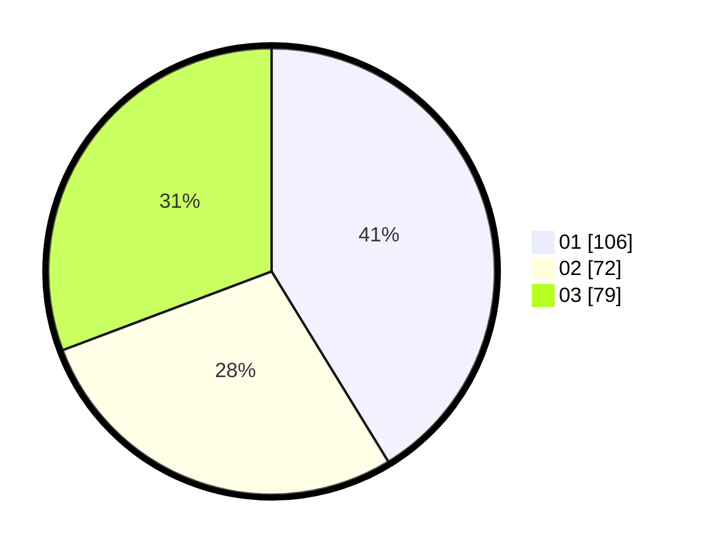

# Hasil

Hasil perolehan suara paslon dapat dilihat pada file paslon-01.txt, paslon-02.txt, dan paslon-03.txt.

Jika tidak ada, artinya data tersebut belum ada pada SIREKAP.

## Perolehan Suara

 * Paslon 01: **106**.
 * Paslon 02: **72**.
 * Paslon 03: **79**.

## Foto C Plano

https://sirekap-obj-formc.kpu.go.id/62bc/pemilu/ppwp/31/74/01/10/02/3174011002041-20240214-205440--a7d01646-f117-4aaa-abbe-63758d5a763d.jpg

https://sirekap-obj-formc.kpu.go.id/62bc/pemilu/ppwp/31/74/01/10/02/3174011002041-20240214-210022--64b6b915-0959-47cc-ad28-34b583c480b7.jpg

https://sirekap-obj-formc.kpu.go.id/62bc/pemilu/ppwp/31/74/01/10/02/3174011002041-20240214-205902--690ef387-07cf-4de2-9b87-06e59b7348a3.jpg

## DATA PEMILIH TETAP

Jumlah pemilih dalam DPT: **288**.
 * L: **138**.
 * P: **150**.

## DATA PENGGUNA HAK PILIH

Jumlah pengguna hak pilih dalam DPT: **247**.
 * L: **115**.
 * P: **132**.

Jumlah pengguna hak pilih dalam DPTb: **11**.
 * L: **1**.
 * P: **10**.

Jumlah pengguna hak pilih dalam DPK: **1**.
 * L: **0**.
 * P: **1**.

Jumlah pengguna hak pilih: **259**.
 * L: **116**.
 * P: **143**.

## JUMLAH SUARA SAH DAN TIDAK SAH

JUMLAH SELURUH SUARA SAH: **257**.

JUMLAH SUARA TIDAK SAH: **2**.

JUMLAH SELURUH SUARA SAH DAN SUARA TIDAK SAH: **259**.
