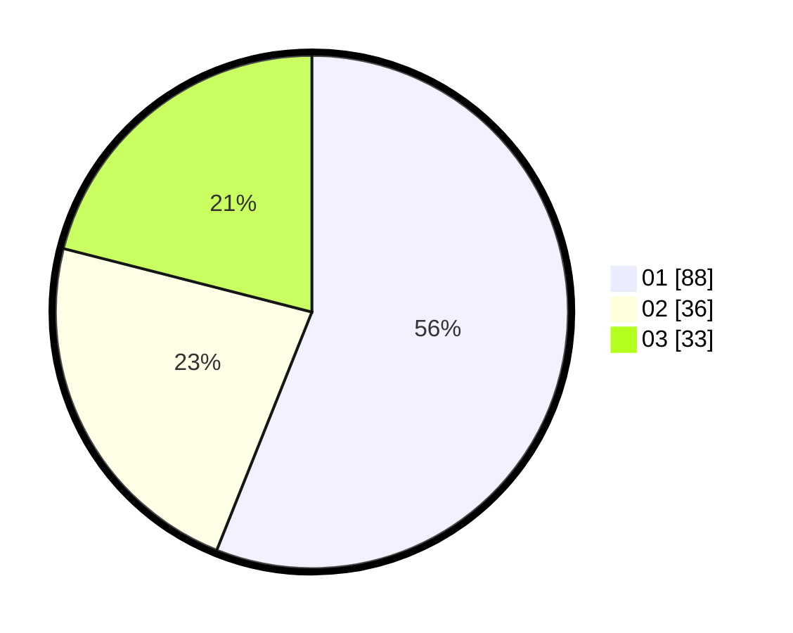

# Hasil

Hasil perolehan suara paslon dapat dilihat pada file paslon-01.txt, paslon-02.txt, dan paslon-03.txt.

Jika tidak ada, artinya data tersebut belum ada pada SIREKAP.

## Perolehan Suara

 * Paslon 01: **88**.
 * Paslon 02: **36**.
 * Paslon 03: **33**.

## Foto C Plano

https://sirekap-obj-formc.kpu.go.id/8890/pemilu/ppwp/31/74/01/10/02/3174011002042-20240214-191746--deb2185e-fab5-438b-8d54-0aac238fa47f.jpg

https://sirekap-obj-formc.kpu.go.id/8890/pemilu/ppwp/31/74/01/10/02/3174011002042-20240214-155521--32bc0fc9-6e22-4fc1-a747-47a33ffab897.jpg

https://sirekap-obj-formc.kpu.go.id/8890/pemilu/ppwp/31/74/01/10/02/3174011002042-20240214-155531--69cff64f-bee7-4f30-85ac-e1f8126d8c29.jpg

## DATA PEMILIH TETAP

Jumlah pemilih dalam DPT: **199**.
 * L: **94**.
 * P: **105**.

## DATA PENGGUNA HAK PILIH

Jumlah pengguna hak pilih dalam DPT: **153**.
 * L: **72**.
 * P: **81**.

Jumlah pengguna hak pilih dalam DPTb: **6**.
 * L: **2**.
 * P: **4**.

Jumlah pengguna hak pilih dalam DPK: **0**.
 * L: **0**.
 * P: **0**.

Jumlah pengguna hak pilih: **159**.
 * L: **74**.
 * P: **85**.

## JUMLAH SUARA SAH DAN TIDAK SAH

JUMLAH SELURUH SUARA SAH: **157**.

JUMLAH SUARA TIDAK SAH: **2**.

JUMLAH SELURUH SUARA SAH DAN SUARA TIDAK SAH: **159**.
