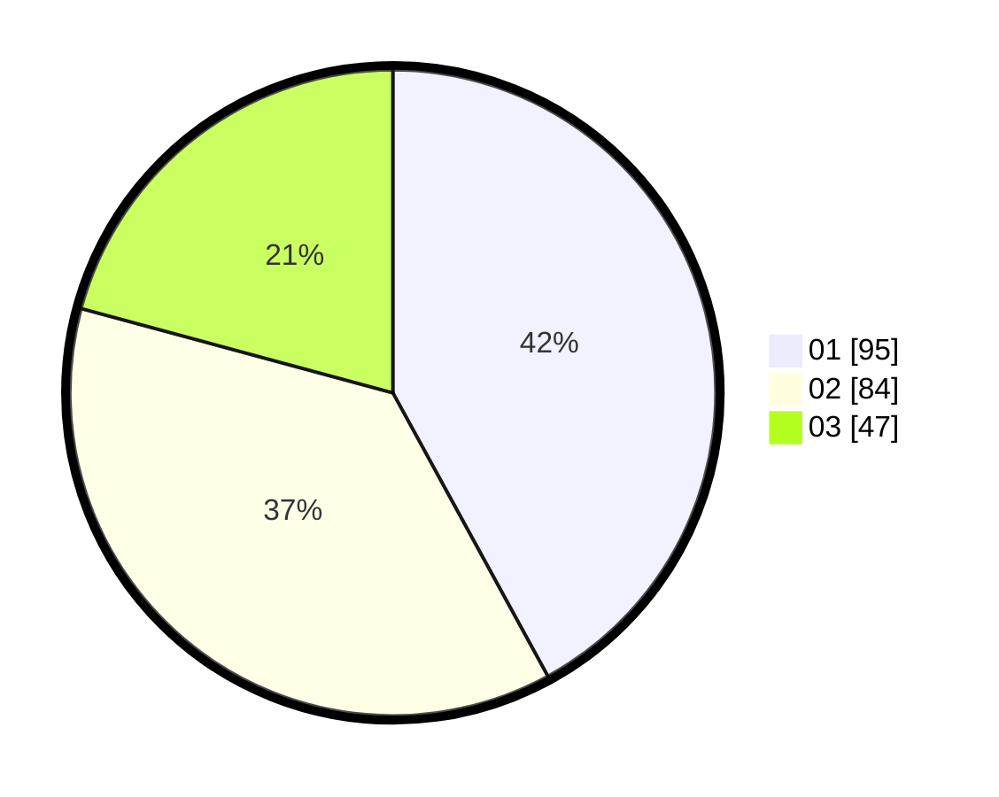

# Hasil

Hasil perolehan suara paslon dapat dilihat pada file paslon-01.txt, paslon-02.txt, dan paslon-03.txt.

Jika tidak ada, artinya data tersebut belum ada pada SIREKAP.

## Perolehan Suara

 * Paslon 01: **95**.
 * Paslon 02: **84**.
 * Paslon 03: **47**.

## Foto C Plano

https://sirekap-obj-formc.kpu.go.id/1db9/pemilu/ppwp/31/74/01/10/02/3174011002045-20240214-203727--35b06f2f-c9c2-4a52-beb6-2f57cee83f67.jpg

https://sirekap-obj-formc.kpu.go.id/1db9/pemilu/ppwp/31/74/01/10/02/3174011002045-20240214-203757--5c01604c-cacc-4468-ade6-ccbb8549623d.jpg

https://sirekap-obj-formc.kpu.go.id/1db9/pemilu/ppwp/31/74/01/10/02/3174011002045-20240214-203803--5bb4e4cf-42b3-465e-a9be-55e084a5bf23.jpg
