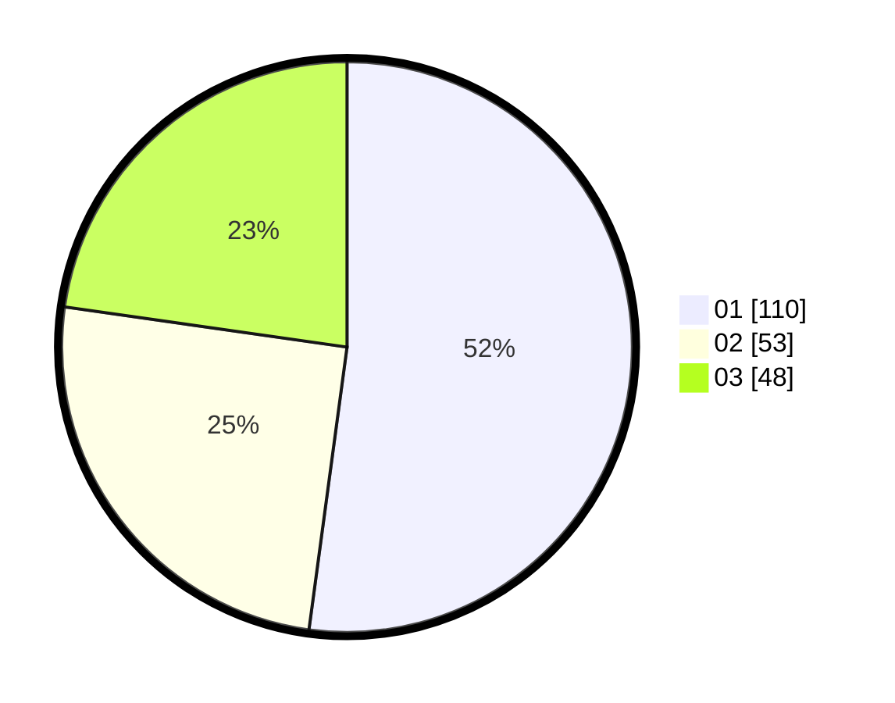

# Hasil

Hasil perolehan suara paslon dapat dilihat pada file paslon-01.txt, paslon-02.txt, dan paslon-03.txt.

Jika tidak ada, artinya data tersebut belum ada pada SIREKAP.

## Perolehan Suara

 * Paslon 01: **110**.
 * Paslon 02: **53**.
 * Paslon 03: **48**.

## Foto C Plano

https://sirekap-obj-formc.kpu.go.id/32c0/pemilu/ppwp/31/74/01/10/02/3174011002048-20240214-185653--0974ab38-bf4b-48ef-811a-7650c53e7fbc.jpg

https://sirekap-obj-formc.kpu.go.id/32c0/pemilu/ppwp/31/74/01/10/02/3174011002048-20240214-155606--98fae5a5-1967-4fd1-aa2a-570433ab5018.jpg

https://sirekap-obj-formc.kpu.go.id/32c0/pemilu/ppwp/31/74/01/10/02/3174011002048-20240214-155751--1563bb30-1475-4c2e-91d4-a61ade6e6c54.jpg

## DATA PEMILIH TETAP

Jumlah pemilih dalam DPT: **249**.
 * L: **116**.
 * P: **133**.

## DATA PENGGUNA HAK PILIH

Jumlah pengguna hak pilih dalam DPT: **199**.
 * L: **91**.
 * P: **108**.

Jumlah pengguna hak pilih dalam DPTb: **16**.
 * L: **6**.
 * P: **10**.

Jumlah pengguna hak pilih dalam DPK: **0**.
 * L: **0**.
 * P: **0**.

Jumlah pengguna hak pilih: **215**.
 * L: **97**.
 * P: **118**.

## JUMLAH SUARA SAH DAN TIDAK SAH

JUMLAH SELURUH SUARA SAH: **211**.

JUMLAH SUARA TIDAK SAH: **4**.

JUMLAH SELURUH SUARA SAH DAN SUARA TIDAK SAH: **215**.
