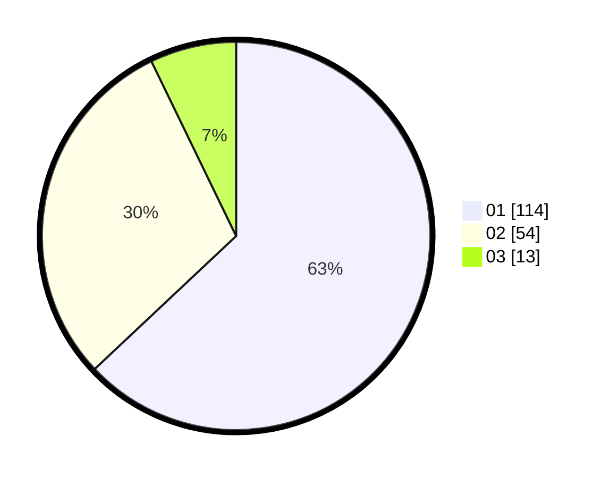

# Hasil

Hasil perolehan suara paslon dapat dilihat pada file paslon-01.txt, paslon-02.txt, dan paslon-03.txt.

Jika tidak ada, artinya data tersebut belum ada pada SIREKAP.

## Perolehan Suara

 * Paslon 01: **114**.
 * Paslon 02: **54**.
 * Paslon 03: **13**.

## Foto C Plano

https://sirekap-obj-formc.kpu.go.id/cc51/pemilu/ppwp/31/74/01/10/03/3174011003019-20240214-193741--9e94f0d7-525b-4c28-ac6a-c9700c7c2892.jpg

https://sirekap-obj-formc.kpu.go.id/cc51/pemilu/ppwp/31/74/01/10/03/3174011003019-20240214-230618--443ff966-16d4-429f-85d9-c18f79c02859.jpg

https://sirekap-obj-formc.kpu.go.id/cc51/pemilu/ppwp/31/74/01/10/03/3174011003019-20240214-194158--248e9ac7-ff78-4119-a3ce-34d70e6c89bc.jpg

## DATA PEMILIH TETAP

Jumlah pemilih dalam DPT: **214**.
 * L: **101**.
 * P: **113**.

## DATA PENGGUNA HAK PILIH

Jumlah pengguna hak pilih dalam DPT: **176**.
 * L: **82**.
 * P: **94**.

Jumlah pengguna hak pilih dalam DPTb: **4**.
 * L: **1**.
 * P: **3**.

Jumlah pengguna hak pilih dalam DPK: **3**.
 * L: **1**.
 * P: **2**.

Jumlah pengguna hak pilih: **183**.
 * L: **84**.
 * P: **99**.

## JUMLAH SUARA SAH DAN TIDAK SAH

JUMLAH SELURUH SUARA SAH: **181**.

JUMLAH SUARA TIDAK SAH: **2**.

JUMLAH SELURUH SUARA SAH DAN SUARA TIDAK SAH: **183**.
