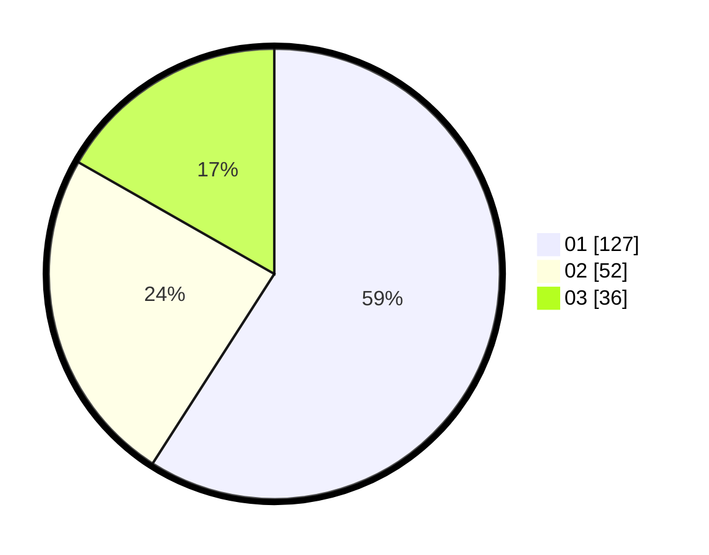

# Hasil

Hasil perolehan suara paslon dapat dilihat pada file paslon-01.txt, paslon-02.txt, dan paslon-03.txt.

Jika tidak ada, artinya data tersebut belum ada pada SIREKAP.

## Perolehan Suara

 * Paslon 01: **127**.
 * Paslon 02: **52**.
 * Paslon 03: **36**.

## Foto C Plano

https://sirekap-obj-formc.kpu.go.id/2ea2/pemilu/ppwp/31/74/01/10/03/3174011003023-20240214-201524--1034b20d-850c-43f1-ad0d-381091c7e539.jpg

https://sirekap-obj-formc.kpu.go.id/2ea2/pemilu/ppwp/31/74/01/10/03/3174011003023-20240214-201539--118a6e46-0972-4ffa-8023-052136ccd7c8.jpg
