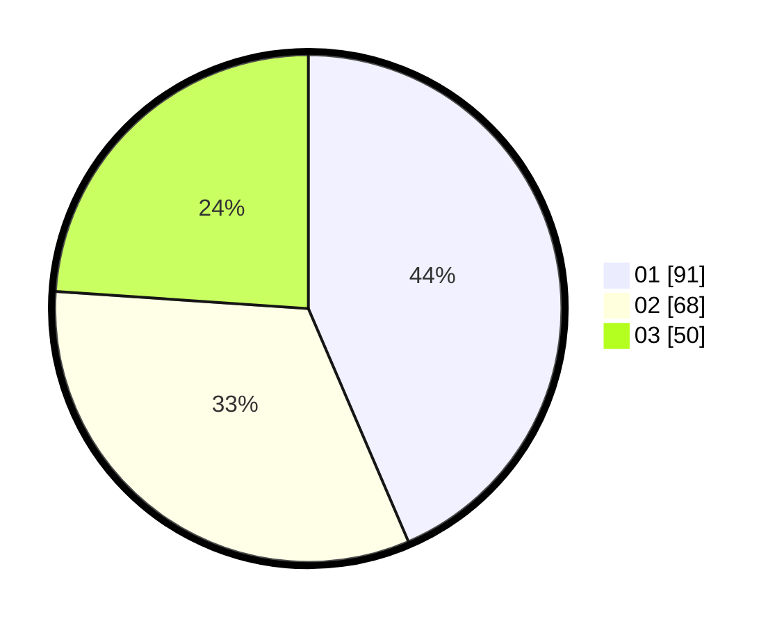

# Hasil

Hasil perolehan suara paslon dapat dilihat pada file paslon-01.txt, paslon-02.txt, dan paslon-03.txt.

Jika tidak ada, artinya data tersebut belum ada pada SIREKAP.

## Perolehan Suara

 * Paslon 01: **91**.
 * Paslon 02: **68**.
 * Paslon 03: **50**.

## Foto C Plano

https://sirekap-obj-formc.kpu.go.id/c1c8/pemilu/ppwp/31/74/01/10/03/3174011003030-20240214-155822--4aafd91e-384b-4235-8a19-e45eb8896c87.jpg

https://sirekap-obj-formc.kpu.go.id/c1c8/pemilu/ppwp/31/74/01/10/03/3174011003030-20240214-160135--f1723d8c-d533-4b85-aaea-34db794ccfc3.jpg

https://sirekap-obj-formc.kpu.go.id/c1c8/pemilu/ppwp/31/74/01/10/03/3174011003030-20240214-203856--080ceb94-a72d-4bb6-a1a7-3af3a2e4d85d.jpg

## DATA PEMILIH TETAP

Jumlah pemilih dalam DPT: **246**.
 * L: **126**.
 * P: **120**.

## DATA PENGGUNA HAK PILIH

Jumlah pengguna hak pilih dalam DPT: **209**.
 * L: **108**.
 * P: **101**.

Jumlah pengguna hak pilih dalam DPTb: **5**.
 * L: **5**.
 * P: **0**.

Jumlah pengguna hak pilih dalam DPK: **0**.
 * L: **0**.
 * P: **0**.

Jumlah pengguna hak pilih: **214**.
 * L: **113**.
 * P: **101**.

## JUMLAH SUARA SAH DAN TIDAK SAH

JUMLAH SELURUH SUARA SAH: **209**.

JUMLAH SUARA TIDAK SAH: **5**.

JUMLAH SELURUH SUARA SAH DAN SUARA TIDAK SAH: **214**.
