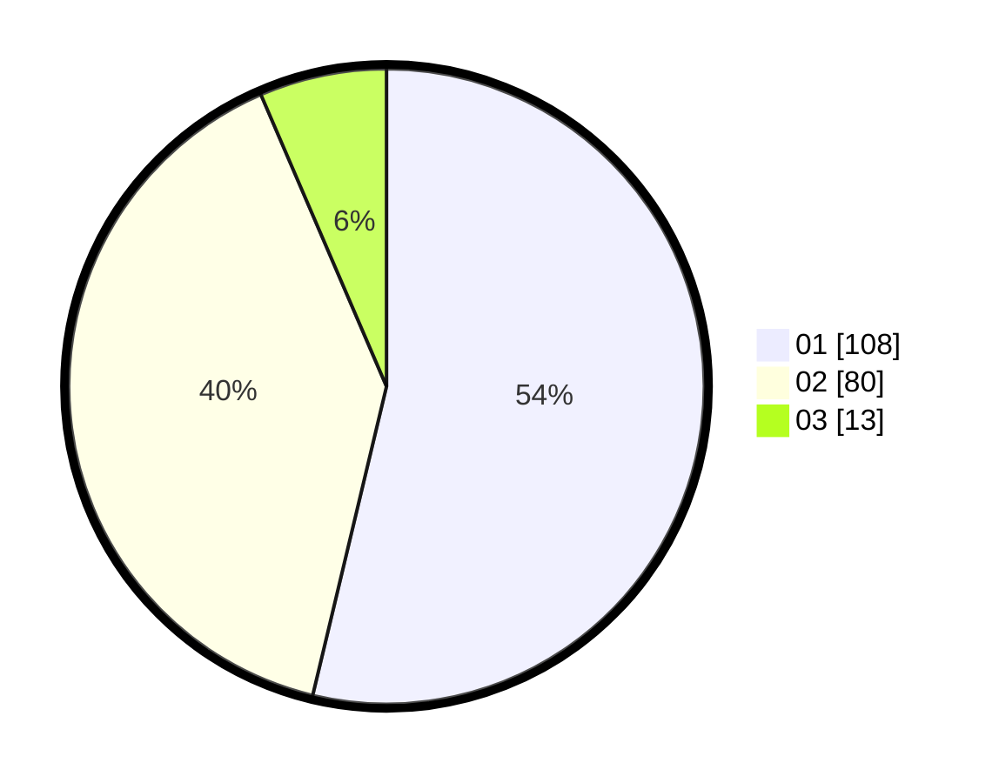

# Hasil

Hasil perolehan suara paslon dapat dilihat pada file paslon-01.txt, paslon-02.txt, dan paslon-03.txt.

Jika tidak ada, artinya data tersebut belum ada pada SIREKAP.

## Perolehan Suara

 * Paslon 01: **108**.
 * Paslon 02: **80**.
 * Paslon 03: **13**.

## Foto C Plano

https://sirekap-obj-formc.kpu.go.id/5cd2/pemilu/ppwp/31/74/01/10/03/3174011003035-20240214-225823--45852cd1-1f39-4b13-9afb-271ac73e8980.jpg

https://sirekap-obj-formc.kpu.go.id/5cd2/pemilu/ppwp/31/74/01/10/03/3174011003035-20240214-191755--c84e2cae-73f6-4f9a-aff2-0231e1646159.jpg

https://sirekap-obj-formc.kpu.go.id/5cd2/pemilu/ppwp/31/74/01/10/03/3174011003035-20240214-225937--a2617659-504c-4ae2-9f86-655781870134.jpg
