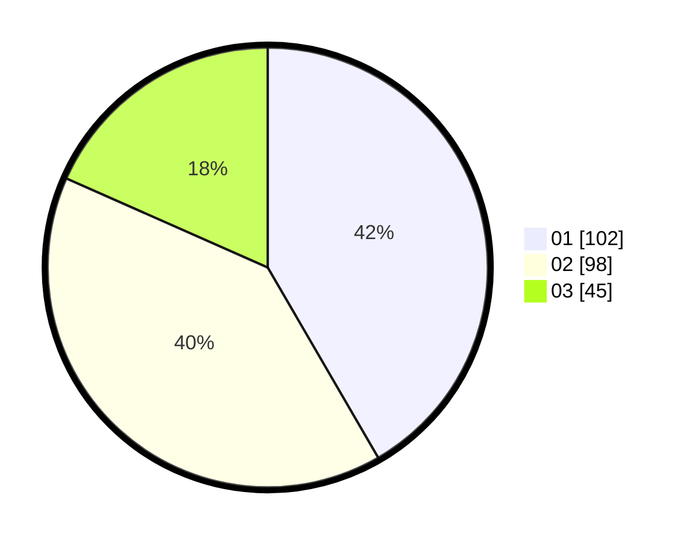

# Hasil

Hasil perolehan suara paslon dapat dilihat pada file paslon-01.txt, paslon-02.txt, dan paslon-03.txt.

Jika tidak ada, artinya data tersebut belum ada pada SIREKAP.

## Perolehan Suara

 * Paslon 01: **102**.
 * Paslon 02: **98**.
 * Paslon 03: **45**.

## Foto C Plano

https://sirekap-obj-formc.kpu.go.id/bbc7/pemilu/ppwp/31/74/01/10/03/3174011003041-20240214-162246--0904708f-78c5-4a50-ac26-d52e220aad21.jpg

https://sirekap-obj-formc.kpu.go.id/bbc7/pemilu/ppwp/31/74/01/10/03/3174011003041-20240214-202952--9dfa0f2c-1cb8-4a1e-9b51-4124f511300c.jpg

https://sirekap-obj-formc.kpu.go.id/bbc7/pemilu/ppwp/31/74/01/10/03/3174011003041-20240214-203008--c01b4985-d9d7-4f62-b2e2-195c23e778c8.jpg

## DATA PEMILIH TETAP

Jumlah pemilih dalam DPT: **267**.
 * L: **120**.
 * P: **147**.

## DATA PENGGUNA HAK PILIH

Jumlah pengguna hak pilih dalam DPT: **230**.
 * L: **100**.
 * P: **130**.

Jumlah pengguna hak pilih dalam DPTb: **13**.
 * L: **4**.
 * P: **9**.

Jumlah pengguna hak pilih dalam DPK: **2**.
 * L: **1**.
 * P: **1**.

Jumlah pengguna hak pilih: **245**.
 * L: **105**.
 * P: **140**.

## JUMLAH SUARA SAH DAN TIDAK SAH

JUMLAH SELURUH SUARA SAH: **245**.

JUMLAH SUARA TIDAK SAH: **0**.

JUMLAH SELURUH SUARA SAH DAN SUARA TIDAK SAH: **245**.
