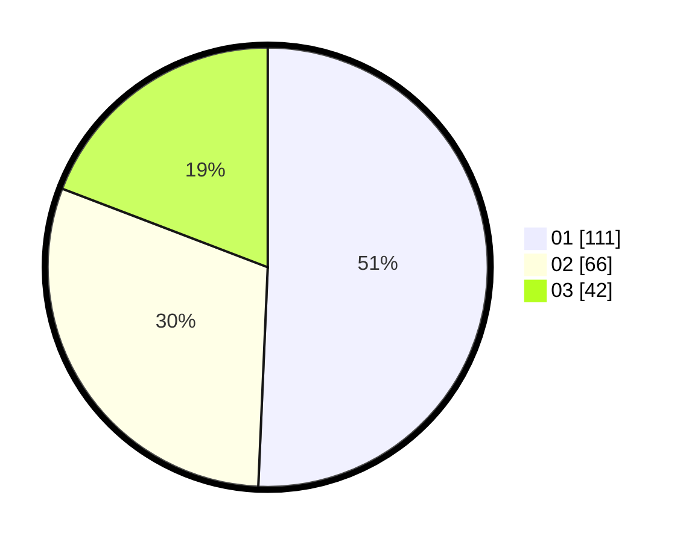

# Hasil

Hasil perolehan suara paslon dapat dilihat pada file paslon-01.txt, paslon-02.txt, dan paslon-03.txt.

Jika tidak ada, artinya data tersebut belum ada pada SIREKAP.

## Perolehan Suara

 * Paslon 01: **111**.
 * Paslon 02: **66**.
 * Paslon 03: **42**.

## Foto C Plano

https://sirekap-obj-formc.kpu.go.id/9efc/pemilu/ppwp/31/74/01/10/03/3174011003045-20240216-010835--04c3f495-be35-49df-a7ca-b780b22ee27d.jpg

https://sirekap-obj-formc.kpu.go.id/9efc/pemilu/ppwp/31/74/01/10/03/3174011003045-20240216-010839--ac7a9ced-2d0f-4baf-b97c-cb0313a81d9b.jpg

https://sirekap-obj-formc.kpu.go.id/9efc/pemilu/ppwp/31/74/01/10/03/3174011003045-20240216-010837--e2a67321-3cf2-48e4-b7b6-dfc60693db19.jpg

## DATA PEMILIH TETAP

Jumlah pemilih dalam DPT: **260**.
 * L: **122**.
 * P: **138**.

## DATA PENGGUNA HAK PILIH

Jumlah pengguna hak pilih dalam DPT: **217**.
 * L: **98**.
 * P: **119**.

Jumlah pengguna hak pilih dalam DPTb: **2**.
 * L: **2**.
 * P: **0**.

Jumlah pengguna hak pilih dalam DPK: **4**.
 * L: **0**.
 * P: **4**.

Jumlah pengguna hak pilih: **223**.
 * L: **100**.
 * P: **123**.

## JUMLAH SUARA SAH DAN TIDAK SAH

JUMLAH SELURUH SUARA SAH: **219**.

JUMLAH SUARA TIDAK SAH: **4**.

JUMLAH SELURUH SUARA SAH DAN SUARA TIDAK SAH: **223**.
