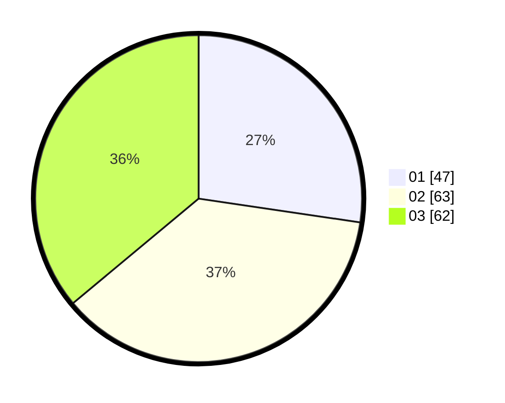

# Hasil

Hasil perolehan suara paslon dapat dilihat pada file paslon-01.txt, paslon-02.txt, dan paslon-03.txt.

Jika tidak ada, artinya data tersebut belum ada pada SIREKAP.

## Perolehan Suara

 * Paslon 01: **47**.
 * Paslon 02: **63**.
 * Paslon 03: **62**.

## Foto C Plano

https://sirekap-obj-formc.kpu.go.id/1878/pemilu/ppwp/31/74/01/10/03/3174011003051-20240214-234224--1add2795-2bd8-442d-b5c0-72eed1cf702e.jpg

https://sirekap-obj-formc.kpu.go.id/1878/pemilu/ppwp/31/74/01/10/03/3174011003051-20240214-234319--8e7651ed-a2e3-4794-8ca3-eb67bc22882d.jpg

https://sirekap-obj-formc.kpu.go.id/1878/pemilu/ppwp/31/74/01/10/03/3174011003051-20240214-234411--21c2c556-8e03-4c02-8d62-236c02479fe6.jpg

## DATA PEMILIH TETAP

Jumlah pemilih dalam DPT: **237**.
 * L: **104**.
 * P: **133**.

## DATA PENGGUNA HAK PILIH

Jumlah pengguna hak pilih dalam DPT: **158**.
 * L: **72**.
 * P: **86**.

Jumlah pengguna hak pilih dalam DPTb: **16**.
 * L: **9**.
 * P: **7**.

Jumlah pengguna hak pilih dalam DPK: **2**.
 * L: **2**.
 * P: **0**.

Jumlah pengguna hak pilih: **176**.
 * L: **83**.
 * P: **93**.

## JUMLAH SUARA SAH DAN TIDAK SAH

JUMLAH SELURUH SUARA SAH: **172**.

JUMLAH SUARA TIDAK SAH: **4**.

JUMLAH SELURUH SUARA SAH DAN SUARA TIDAK SAH: **176**.
