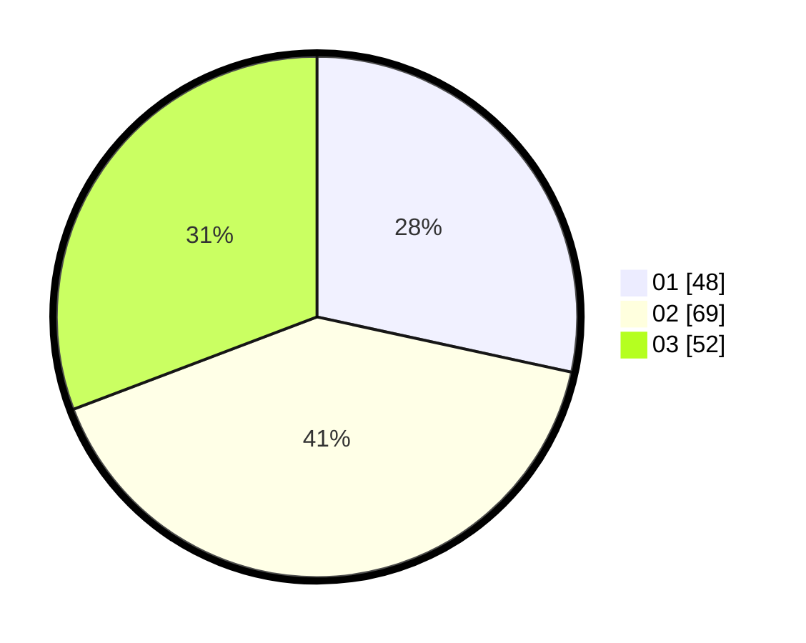

# Hasil

Hasil perolehan suara paslon dapat dilihat pada file paslon-01.txt, paslon-02.txt, dan paslon-03.txt.

Jika tidak ada, artinya data tersebut belum ada pada SIREKAP.

## Perolehan Suara

 * Paslon 01: **48**.
 * Paslon 02: **69**.
 * Paslon 03: **52**.

## Foto C Plano

https://sirekap-obj-formc.kpu.go.id/26e1/pemilu/ppwp/31/74/01/10/03/3174011003053-20240214-195033--86211dcb-893f-4f2f-a6e7-8cb11edba823.jpg

https://sirekap-obj-formc.kpu.go.id/26e1/pemilu/ppwp/31/74/01/10/03/3174011003053-20240214-195659--0a0c1035-f5cc-44c8-a805-c574da06a047.jpg

https://sirekap-obj-formc.kpu.go.id/26e1/pemilu/ppwp/31/74/01/10/03/3174011003053-20240214-195803--4f9a5f74-1ed6-47be-a4fb-695df903bd9e.jpg
