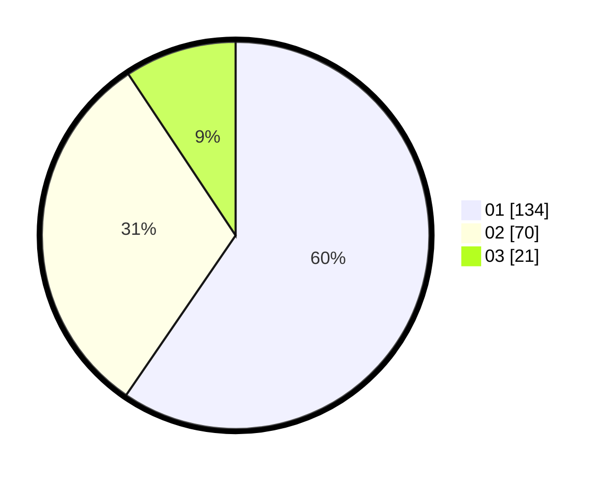

# Hasil

Hasil perolehan suara paslon dapat dilihat pada file paslon-01.txt, paslon-02.txt, dan paslon-03.txt.

Jika tidak ada, artinya data tersebut belum ada pada SIREKAP.

## Perolehan Suara

 * Paslon 01: **134**.
 * Paslon 02: **70**.
 * Paslon 03: **21**.

## Foto C Plano

https://sirekap-obj-formc.kpu.go.id/304b/pemilu/ppwp/31/74/01/10/03/3174011003059-20240215-190659--facc2974-94c6-455b-8d5c-f64dff3c3c5b.jpg

https://sirekap-obj-formc.kpu.go.id/304b/pemilu/ppwp/31/74/01/10/03/3174011003059-20240214-185857--091ad501-4b3e-4804-a0b7-404dbd305624.jpg

https://sirekap-obj-formc.kpu.go.id/304b/pemilu/ppwp/31/74/01/10/03/3174011003059-20240214-185052--d8a09f4c-8bfe-43b5-924a-3ae587863cf7.jpg

## DATA PEMILIH TETAP

Jumlah pemilih dalam DPT: **259**.
 * L: **116**.
 * P: **143**.

## DATA PENGGUNA HAK PILIH

Jumlah pengguna hak pilih dalam DPT: **219**.
 * L: **97**.
 * P: **122**.

Jumlah pengguna hak pilih dalam DPTb: **6**.
 * L: **1**.
 * P: **5**.

Jumlah pengguna hak pilih dalam DPK: **1**.
 * L: **1**.
 * P: **0**.

Jumlah pengguna hak pilih: **226**.
 * L: **99**.
 * P: **127**.

## JUMLAH SUARA SAH DAN TIDAK SAH

JUMLAH SELURUH SUARA SAH: **225**.

JUMLAH SUARA TIDAK SAH: **1**.

JUMLAH SELURUH SUARA SAH DAN SUARA TIDAK SAH: **226**.
