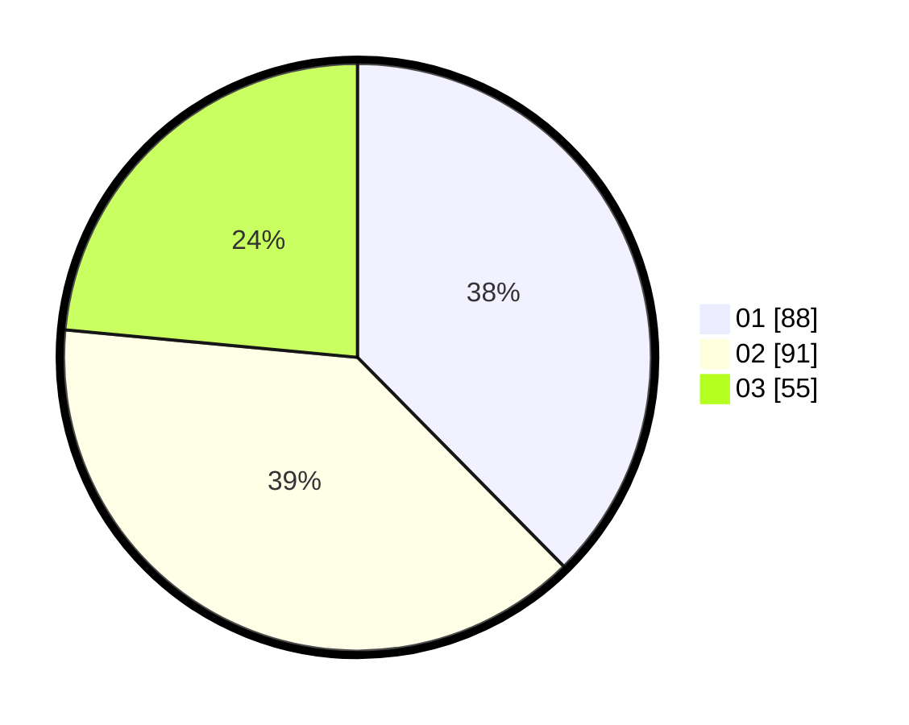

# Hasil

Hasil perolehan suara paslon dapat dilihat pada file paslon-01.txt, paslon-02.txt, dan paslon-03.txt.

Jika tidak ada, artinya data tersebut belum ada pada SIREKAP.

## Perolehan Suara

 * Paslon 01: **88**.
 * Paslon 02: **91**.
 * Paslon 03: **55**.

## Foto C Plano

https://sirekap-obj-formc.kpu.go.id/791d/pemilu/ppwp/31/74/01/10/03/3174011003062-20240214-212459--232a8e13-3cab-4d8a-aac9-93fe6743e1bc.jpg

https://sirekap-obj-formc.kpu.go.id/791d/pemilu/ppwp/31/74/01/10/03/3174011003062-20240214-212606--f74412ff-0ad0-4efb-9553-e3f33f1bb54f.jpg

https://sirekap-obj-formc.kpu.go.id/791d/pemilu/ppwp/31/74/01/10/03/3174011003062-20240214-212611--c73c775a-0eaf-4abc-817d-24dc5d09aaa2.jpg
