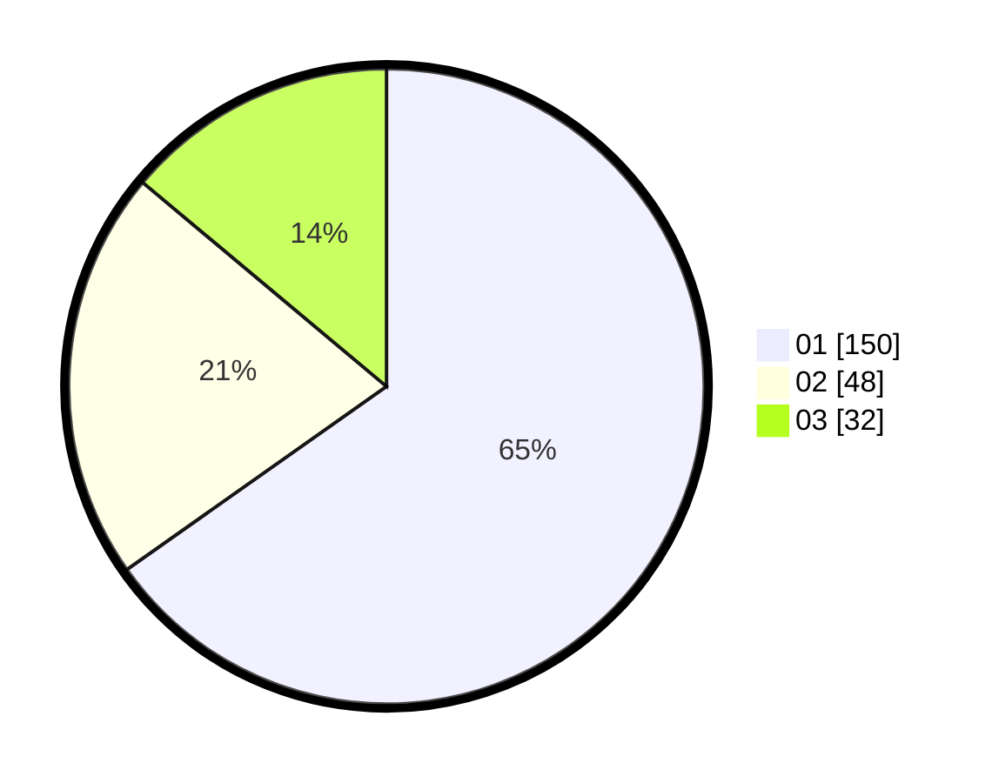

# Hasil

Hasil perolehan suara paslon dapat dilihat pada file paslon-01.txt, paslon-02.txt, dan paslon-03.txt.

Jika tidak ada, artinya data tersebut belum ada pada SIREKAP.

## Perolehan Suara

 * Paslon 01: **150**.
 * Paslon 02: **48**.
 * Paslon 03: **32**.

## Foto C Plano

https://sirekap-obj-formc.kpu.go.id/518c/pemilu/ppwp/31/74/01/10/03/3174011003068-20240217-172734--329566f0-f250-4cbd-94f7-4544fcd45aba.jpg

https://sirekap-obj-formc.kpu.go.id/518c/pemilu/ppwp/31/74/01/10/03/3174011003068-20240217-172739--d088c472-3665-4bab-a7d7-3ef1c5984722.jpg

https://sirekap-obj-formc.kpu.go.id/518c/pemilu/ppwp/31/74/01/10/03/3174011003068-20240217-173530--13fcb0a0-5916-4809-8bc8-fee3ca5bfdf3.jpg

## DATA PEMILIH TETAP

Jumlah pemilih dalam DPT: **262**.
 * L: **135**.
 * P: **127**.

## DATA PENGGUNA HAK PILIH

Jumlah pengguna hak pilih dalam DPT: **224**.
 * L: **114**.
 * P: **110**.

Jumlah pengguna hak pilih dalam DPTb: **3**.
 * L: **1**.
 * P: **2**.

Jumlah pengguna hak pilih dalam DPK: **4**.
 * L: **2**.
 * P: **2**.

Jumlah pengguna hak pilih: **231**.
 * L: **117**.
 * P: **114**.

## JUMLAH SUARA SAH DAN TIDAK SAH

JUMLAH SELURUH SUARA SAH: **230**.

JUMLAH SUARA TIDAK SAH: **1**.

JUMLAH SELURUH SUARA SAH DAN SUARA TIDAK SAH: **231**.
