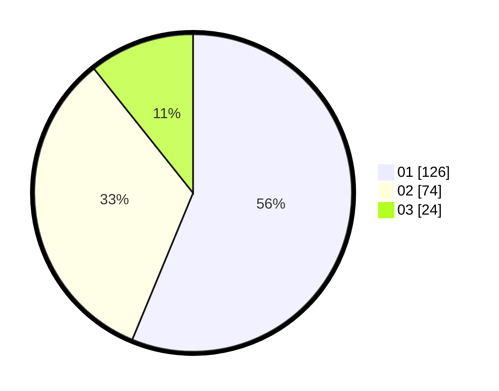

# Hasil

Hasil perolehan suara paslon dapat dilihat pada file paslon-01.txt, paslon-02.txt, dan paslon-03.txt.

Jika tidak ada, artinya data tersebut belum ada pada SIREKAP.

## Perolehan Suara

 * Paslon 01: **126**.
 * Paslon 02: **74**.
 * Paslon 03: **24**.

## Foto C Plano

https://sirekap-obj-formc.kpu.go.id/b411/pemilu/ppwp/31/74/01/10/03/3174011003071-20240214-155028--6fbbd32b-6ef6-4459-9a9b-58aa857dbc35.jpg

https://sirekap-obj-formc.kpu.go.id/b411/pemilu/ppwp/31/74/01/10/03/3174011003071-20240214-155033--62d3b9ce-6c28-4a24-8276-e41cda54d93d.jpg

https://sirekap-obj-formc.kpu.go.id/b411/pemilu/ppwp/31/74/01/10/03/3174011003071-20240214-155037--6728a642-4dfd-4df3-a458-4fcb1a55b455.jpg

## DATA PEMILIH TETAP

Jumlah pemilih dalam DPT: **266**.
 * L: **130**.
 * P: **136**.

## DATA PENGGUNA HAK PILIH

Jumlah pengguna hak pilih dalam DPT: **219**.
 * L: **106**.
 * P: **113**.

Jumlah pengguna hak pilih dalam DPTb: **4**.
 * L: **0**.
 * P: **4**.

Jumlah pengguna hak pilih dalam DPK: **4**.
 * L: **3**.
 * P: **1**.

Jumlah pengguna hak pilih: **227**.
 * L: **109**.
 * P: **118**.

## JUMLAH SUARA SAH DAN TIDAK SAH

JUMLAH SELURUH SUARA SAH: **224**.

JUMLAH SUARA TIDAK SAH: **3**.

JUMLAH SELURUH SUARA SAH DAN SUARA TIDAK SAH: **227**.
