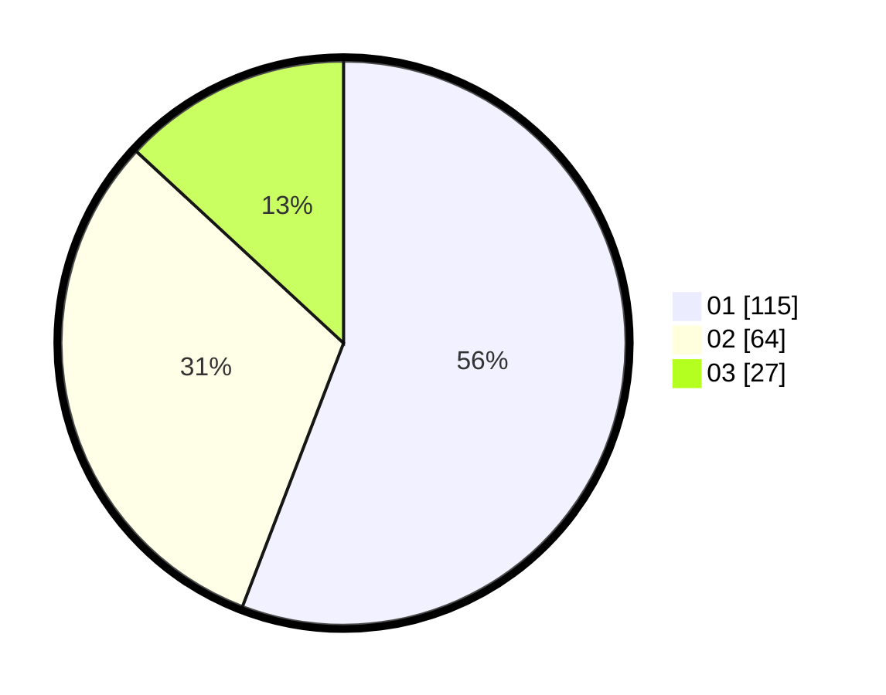

# Hasil

Hasil perolehan suara paslon dapat dilihat pada file paslon-01.txt, paslon-02.txt, dan paslon-03.txt.

Jika tidak ada, artinya data tersebut belum ada pada SIREKAP.

## Perolehan Suara

 * Paslon 01: **115**.
 * Paslon 02: **64**.
 * Paslon 03: **27**.

## Foto C Plano

https://sirekap-obj-formc.kpu.go.id/5831/pemilu/ppwp/31/74/01/10/03/3174011003079-20240214-184907--81ea23fb-2042-4c42-a33d-eee03c404235.jpg

https://sirekap-obj-formc.kpu.go.id/5831/pemilu/ppwp/31/74/01/10/03/3174011003079-20240214-184925--1029afd1-d5d5-43dc-b8c0-6130cf5e529b.jpg

https://sirekap-obj-formc.kpu.go.id/5831/pemilu/ppwp/31/74/01/10/03/3174011003079-20240214-184944--6e4a9add-a48c-49fc-8377-f7704731b8aa.jpg

## DATA PEMILIH TETAP

Jumlah pemilih dalam DPT: **255**.
 * L: **125**.
 * P: **130**.

## DATA PENGGUNA HAK PILIH

Jumlah pengguna hak pilih dalam DPT: **210**.
 * L: **109**.
 * P: **101**.

Jumlah pengguna hak pilih dalam DPTb: **3**.
 * L: **1**.
 * P: **2**.

Jumlah pengguna hak pilih dalam DPK: **1**.
 * L: **0**.
 * P: **1**.

Jumlah pengguna hak pilih: **214**.
 * L: **110**.
 * P: **104**.

## JUMLAH SUARA SAH DAN TIDAK SAH

JUMLAH SELURUH SUARA SAH: **206**.

JUMLAH SUARA TIDAK SAH: **8**.

JUMLAH SELURUH SUARA SAH DAN SUARA TIDAK SAH: **214**.
