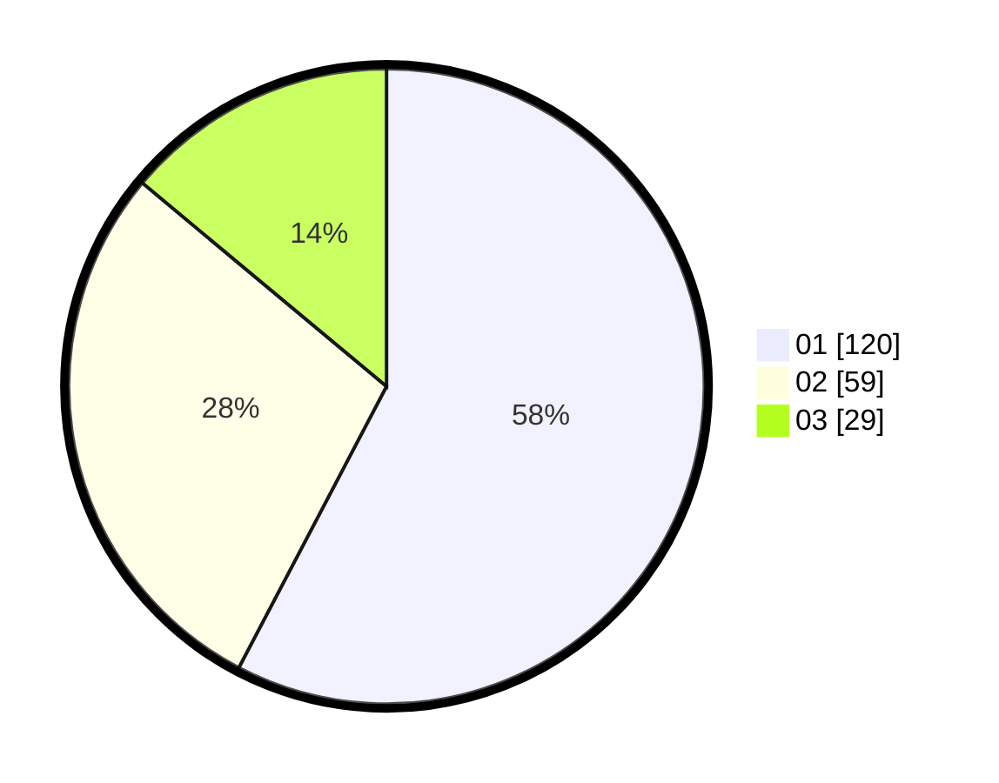

# Hasil

Hasil perolehan suara paslon dapat dilihat pada file paslon-01.txt, paslon-02.txt, dan paslon-03.txt.

Jika tidak ada, artinya data tersebut belum ada pada SIREKAP.

## Perolehan Suara

 * Paslon 01: **120**.
 * Paslon 02: **59**.
 * Paslon 03: **29**.

## Foto C Plano

https://sirekap-obj-formc.kpu.go.id/6c8d/pemilu/ppwp/31/74/01/10/03/3174011003090-20240214-205206--52548650-4616-4dbc-926f-dd855c5b50be.jpg

https://sirekap-obj-formc.kpu.go.id/6c8d/pemilu/ppwp/31/74/01/10/03/3174011003090-20240214-233007--f5787e07-d365-457d-a080-ba1f2ccee655.jpg

https://sirekap-obj-formc.kpu.go.id/6c8d/pemilu/ppwp/31/74/01/10/03/3174011003090-20240214-214602--bf228504-aafc-47bf-9db7-2ec8c2986025.jpg

## DATA PEMILIH TETAP

Jumlah pemilih dalam DPT: **264**.
 * L: **129**.
 * P: **135**.

## DATA PENGGUNA HAK PILIH

Jumlah pengguna hak pilih dalam DPT: **214**.
 * L: **102**.
 * P: **112**.

Jumlah pengguna hak pilih dalam DPTb: **1**.
 * L: **1**.
 * P: **0**.

Jumlah pengguna hak pilih dalam DPK: **0**.
 * L: **0**.
 * P: **0**.

Jumlah pengguna hak pilih: **215**.
 * L: **103**.
 * P: **112**.

## JUMLAH SUARA SAH DAN TIDAK SAH

JUMLAH SELURUH SUARA SAH: **208**.

JUMLAH SUARA TIDAK SAH: **7**.

JUMLAH SELURUH SUARA SAH DAN SUARA TIDAK SAH: **215**.
