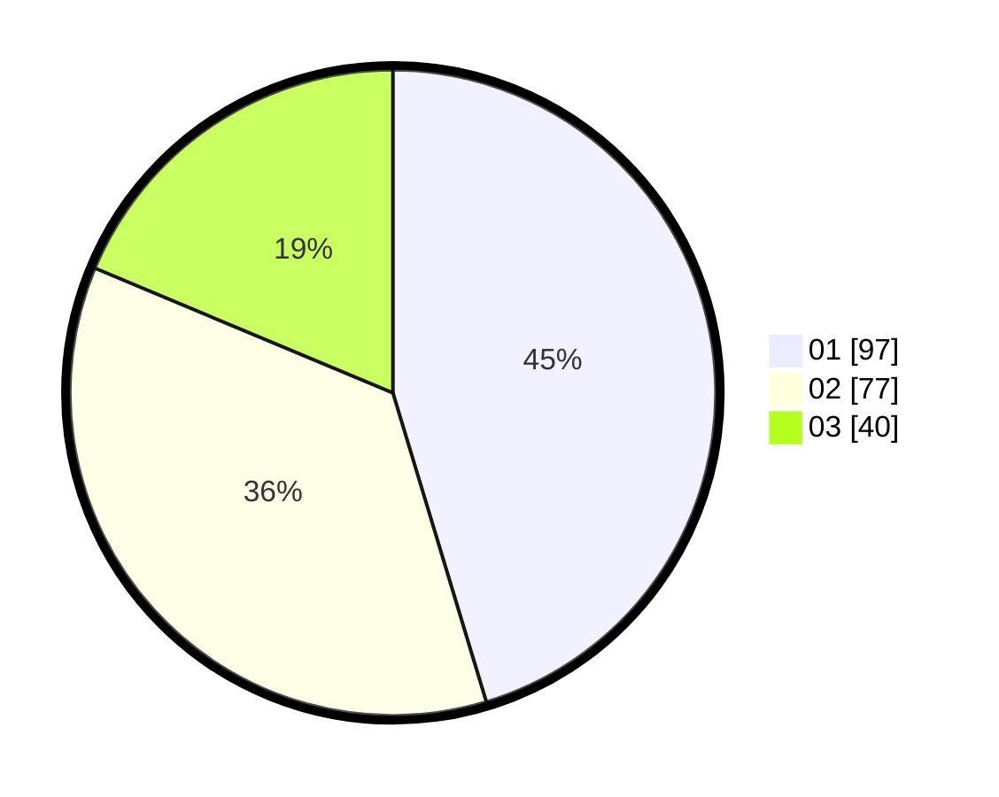

# Hasil

Hasil perolehan suara paslon dapat dilihat pada file paslon-01.txt, paslon-02.txt, dan paslon-03.txt.

Jika tidak ada, artinya data tersebut belum ada pada SIREKAP.

## Perolehan Suara

 * Paslon 01: **97**.
 * Paslon 02: **77**.
 * Paslon 03: **40**.

## Foto C Plano

https://sirekap-obj-formc.kpu.go.id/af1c/pemilu/ppwp/31/74/01/10/03/3174011003096-20240214-192020--10a9329c-5604-4289-8d3d-b9b28aff23ef.jpg

https://sirekap-obj-formc.kpu.go.id/af1c/pemilu/ppwp/31/74/01/10/03/3174011003096-20240214-192142--8b42db5f-bc06-4693-a07a-ba107a106210.jpg

https://sirekap-obj-formc.kpu.go.id/af1c/pemilu/ppwp/31/74/01/10/03/3174011003096-20240214-192240--4bf10d27-44da-424a-b59e-11bb78540ccf.jpg

## DATA PEMILIH TETAP

Jumlah pemilih dalam DPT: **273**.
 * L: **129**.
 * P: **144**.

## DATA PENGGUNA HAK PILIH

Jumlah pengguna hak pilih dalam DPT: **205**.
 * L: **95**.
 * P: **110**.

Jumlah pengguna hak pilih dalam DPTb: **12**.
 * L: **5**.
 * P: **7**.

Jumlah pengguna hak pilih dalam DPK: **3**.
 * L: **0**.
 * P: **3**.

Jumlah pengguna hak pilih: **220**.
 * L: **100**.
 * P: **120**.

## JUMLAH SUARA SAH DAN TIDAK SAH

JUMLAH SELURUH SUARA SAH: **214**.

JUMLAH SUARA TIDAK SAH: **6**.

JUMLAH SELURUH SUARA SAH DAN SUARA TIDAK SAH: **220**.
