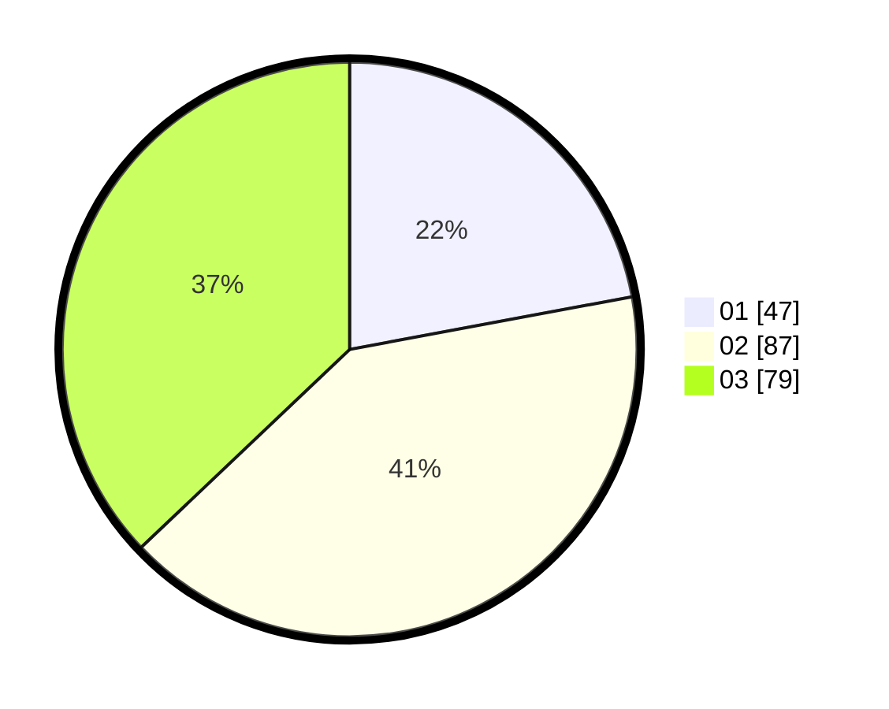

# Hasil

Hasil perolehan suara paslon dapat dilihat pada file paslon-01.txt, paslon-02.txt, dan paslon-03.txt.

Jika tidak ada, artinya data tersebut belum ada pada SIREKAP.

## Perolehan Suara

 * Paslon 01: **47**.
 * Paslon 02: **87**.
 * Paslon 03: **79**.

## Foto C Plano

https://sirekap-obj-formc.kpu.go.id/12bd/pemilu/ppwp/31/74/01/10/03/3174011003097-20240214-185852--f9bb7bc7-9ec2-47b3-8c4f-237a7b23f705.jpg

https://sirekap-obj-formc.kpu.go.id/12bd/pemilu/ppwp/31/74/01/10/03/3174011003097-20240214-185909--b094f9db-bfac-4de4-a5dd-7874a1a7fd82.jpg

https://sirekap-obj-formc.kpu.go.id/12bd/pemilu/ppwp/31/74/01/10/03/3174011003097-20240214-185914--8782dc73-63f3-4327-b972-67c8e529d9fc.jpg

## DATA PEMILIH TETAP

Jumlah pemilih dalam DPT: **271**.
 * L: **124**.
 * P: **147**.

## DATA PENGGUNA HAK PILIH

Jumlah pengguna hak pilih dalam DPT: **193**.
 * L: **91**.
 * P: **102**.

Jumlah pengguna hak pilih dalam DPTb: **14**.
 * L: **5**.
 * P: **9**.

Jumlah pengguna hak pilih dalam DPK: **8**.
 * L: **3**.
 * P: **5**.

Jumlah pengguna hak pilih: **215**.
 * L: **99**.
 * P: **116**.

## JUMLAH SUARA SAH DAN TIDAK SAH

JUMLAH SELURUH SUARA SAH: **213**.

JUMLAH SUARA TIDAK SAH: **2**.

JUMLAH SELURUH SUARA SAH DAN SUARA TIDAK SAH: **215**.
