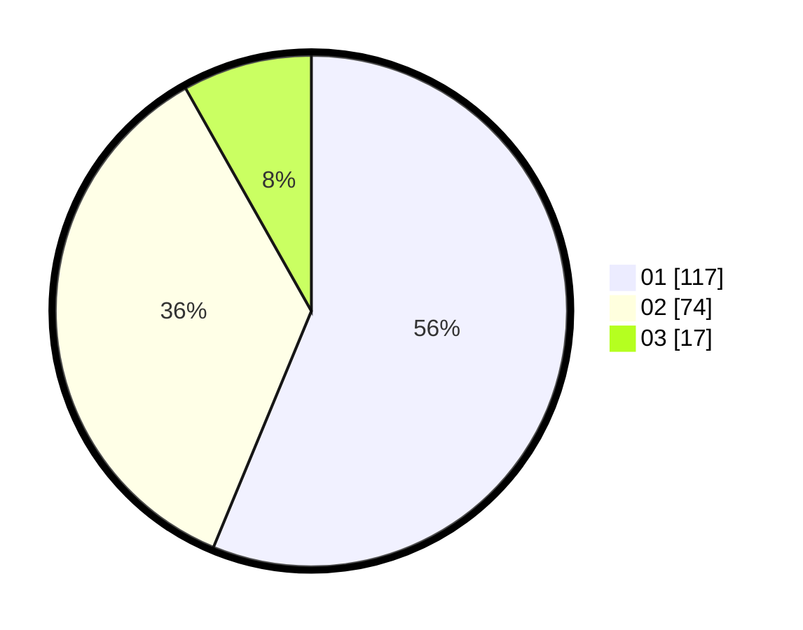

# Hasil

Hasil perolehan suara paslon dapat dilihat pada file paslon-01.txt, paslon-02.txt, dan paslon-03.txt.

Jika tidak ada, artinya data tersebut belum ada pada SIREKAP.

## Perolehan Suara

 * Paslon 01: **117**.
 * Paslon 02: **74**.
 * Paslon 03: **17**.

## Foto C Plano

https://sirekap-obj-formc.kpu.go.id/c6b5/pemilu/ppwp/31/74/01/10/03/3174011003100-20240216-135308--554ef183-7137-4ac6-b89c-78e2c003cb0c.jpg

https://sirekap-obj-formc.kpu.go.id/c6b5/pemilu/ppwp/31/74/01/10/03/3174011003100-20240216-135310--4131459a-8112-472e-8f4e-e48691158024.jpg

https://sirekap-obj-formc.kpu.go.id/c6b5/pemilu/ppwp/31/74/01/10/03/3174011003100-20240216-135309--688b8693-bd0f-4b7b-966f-006143381b5b.jpg

## DATA PEMILIH TETAP

Jumlah pemilih dalam DPT: **259**.
 * L: **127**.
 * P: **132**.

## DATA PENGGUNA HAK PILIH

Jumlah pengguna hak pilih dalam DPT: **204**.
 * L: **91**.
 * P: **113**.

Jumlah pengguna hak pilih dalam DPTb: **2**.
 * L: **1**.
 * P: **1**.

Jumlah pengguna hak pilih dalam DPK: **2**.
 * L: **1**.
 * P: **1**.

Jumlah pengguna hak pilih: **208**.
 * L: **93**.
 * P: **115**.

## JUMLAH SUARA SAH DAN TIDAK SAH

JUMLAH SELURUH SUARA SAH: **208**.

JUMLAH SUARA TIDAK SAH: **0**.

JUMLAH SELURUH SUARA SAH DAN SUARA TIDAK SAH: **208**.
