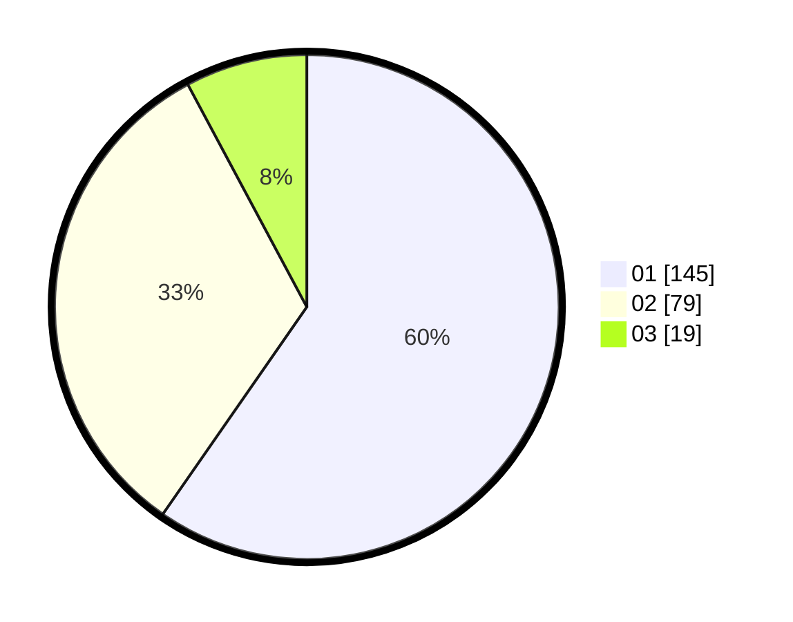

# Hasil

Hasil perolehan suara paslon dapat dilihat pada file paslon-01.txt, paslon-02.txt, dan paslon-03.txt.

Jika tidak ada, artinya data tersebut belum ada pada SIREKAP.

## Perolehan Suara

 * Paslon 01: **145**.
 * Paslon 02: **79**.
 * Paslon 03: **19**.

## Foto C Plano

https://sirekap-obj-formc.kpu.go.id/7328/pemilu/ppwp/31/74/01/10/03/3174011003116-20240214-234618--77509b5d-ba9b-4761-8fb3-11e51902d594.jpg

https://sirekap-obj-formc.kpu.go.id/7328/pemilu/ppwp/31/74/01/10/03/3174011003116-20240214-234720--e59c815c-1b1d-441d-914b-a448ff99d843.jpg

https://sirekap-obj-formc.kpu.go.id/7328/pemilu/ppwp/31/74/01/10/03/3174011003116-20240214-234816--a700ea0b-8c2c-448a-b9cc-5e4807baf4e3.jpg

## DATA PEMILIH TETAP

Jumlah pemilih dalam DPT: **267**.
 * L: **131**.
 * P: **136**.

## DATA PENGGUNA HAK PILIH

Jumlah pengguna hak pilih dalam DPT: **241**.
 * L: **116**.
 * P: **125**.

Jumlah pengguna hak pilih dalam DPTb: **2**.
 * L: **0**.
 * P: **2**.

Jumlah pengguna hak pilih dalam DPK: **1**.
 * L: **0**.
 * P: **1**.

Jumlah pengguna hak pilih: **244**.
 * L: **116**.
 * P: **128**.

## JUMLAH SUARA SAH DAN TIDAK SAH

JUMLAH SELURUH SUARA SAH: **243**.

JUMLAH SUARA TIDAK SAH: **1**.

JUMLAH SELURUH SUARA SAH DAN SUARA TIDAK SAH: **244**.
