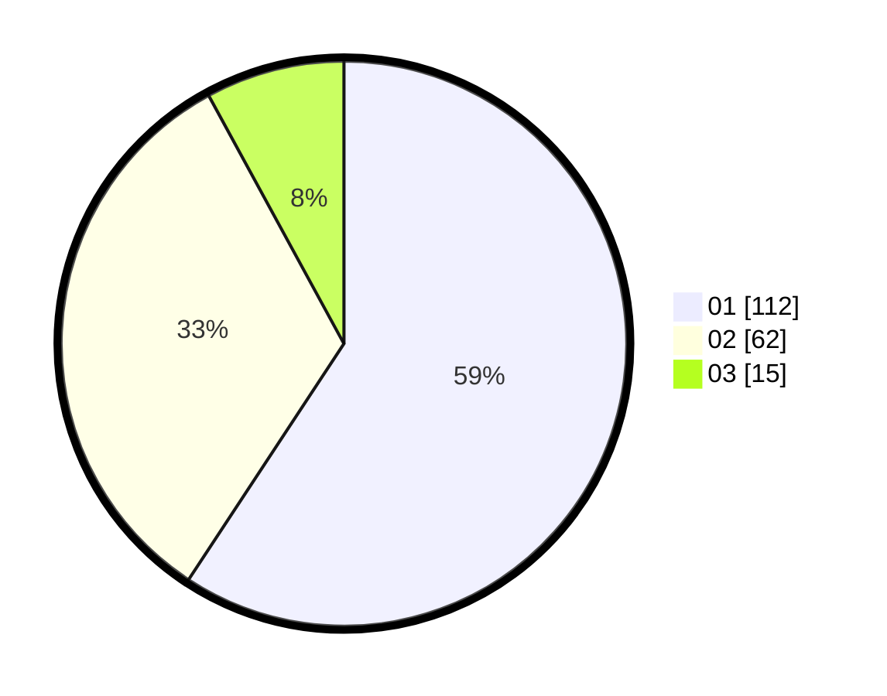

# Hasil

Hasil perolehan suara paslon dapat dilihat pada file paslon-01.txt, paslon-02.txt, dan paslon-03.txt.

Jika tidak ada, artinya data tersebut belum ada pada SIREKAP.

## Perolehan Suara

 * Paslon 01: **112**.
 * Paslon 02: **62**.
 * Paslon 03: **15**.

## Foto C Plano

https://sirekap-obj-formc.kpu.go.id/55fd/pemilu/ppwp/31/74/01/10/03/3174011003120-20240214-155825--98e75c2d-7090-4690-8e05-4b956be8e293.jpg

https://sirekap-obj-formc.kpu.go.id/55fd/pemilu/ppwp/31/74/01/10/03/3174011003120-20240214-160057--d32219ae-41c4-4d4c-b366-877aaf57760b.jpg

https://sirekap-obj-formc.kpu.go.id/55fd/pemilu/ppwp/31/74/01/10/03/3174011003120-20240214-160058--7a0e2f5b-9b96-4588-b2d0-ef2ec96f494c.jpg

## DATA PEMILIH TETAP

Jumlah pemilih dalam DPT: **251**.
 * L: **128**.
 * P: **123**.

## DATA PENGGUNA HAK PILIH

Jumlah pengguna hak pilih dalam DPT: **189**.
 * L: **95**.
 * P: **94**.

Jumlah pengguna hak pilih dalam DPTb: **1**.
 * L: **1**.
 * P: **0**.

Jumlah pengguna hak pilih dalam DPK: **1**.
 * L: **0**.
 * P: **1**.

Jumlah pengguna hak pilih: **191**.
 * L: **96**.
 * P: **95**.

## JUMLAH SUARA SAH DAN TIDAK SAH

JUMLAH SELURUH SUARA SAH: **189**.

JUMLAH SUARA TIDAK SAH: **2**.

JUMLAH SELURUH SUARA SAH DAN SUARA TIDAK SAH: **191**.
