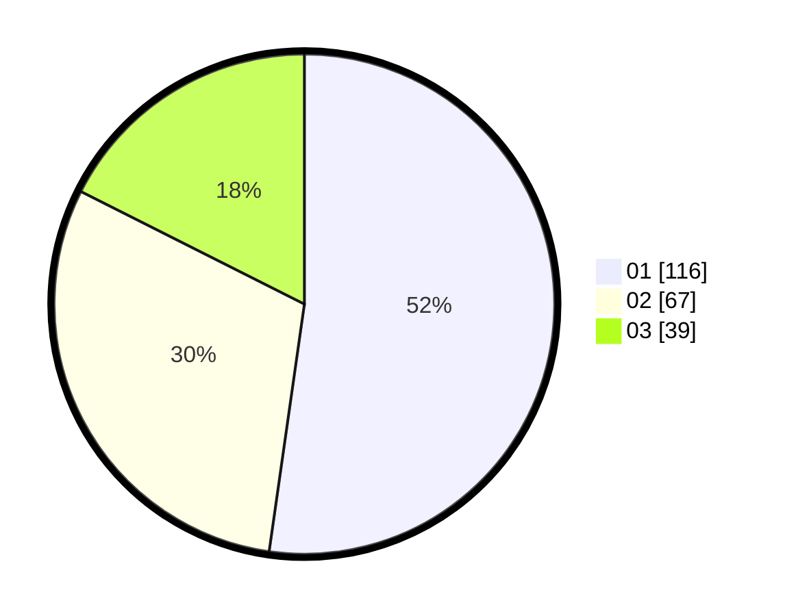

# Hasil

Hasil perolehan suara paslon dapat dilihat pada file paslon-01.txt, paslon-02.txt, dan paslon-03.txt.

Jika tidak ada, artinya data tersebut belum ada pada SIREKAP.

## Perolehan Suara

 * Paslon 01: **116**.
 * Paslon 02: **67**.
 * Paslon 03: **39**.

## Foto C Plano

https://sirekap-obj-formc.kpu.go.id/b8e3/pemilu/ppwp/31/74/01/10/03/3174011003124-20240215-211350--6084f276-afce-4060-98ce-6798bd29824c.jpg

https://sirekap-obj-formc.kpu.go.id/b8e3/pemilu/ppwp/31/74/01/10/03/3174011003124-20240215-211352--af0941a4-7abc-4ce8-8c9c-ebc2fce18065.jpg

https://sirekap-obj-formc.kpu.go.id/b8e3/pemilu/ppwp/31/74/01/10/03/3174011003124-20240215-211351--9982ae09-2493-42ca-a577-295659d38644.jpg

## DATA PEMILIH TETAP

Jumlah pemilih dalam DPT: **258**.
 * L: **123**.
 * P: **135**.

## DATA PENGGUNA HAK PILIH

Jumlah pengguna hak pilih dalam DPT: **227**.
 * L: **104**.
 * P: **123**.

Jumlah pengguna hak pilih dalam DPTb: **1**.
 * L: **1**.
 * P: **0**.

Jumlah pengguna hak pilih dalam DPK: **0**.
 * L: **0**.
 * P: **0**.

Jumlah pengguna hak pilih: **228**.
 * L: **105**.
 * P: **123**.

## JUMLAH SUARA SAH DAN TIDAK SAH

JUMLAH SELURUH SUARA SAH: **222**.

JUMLAH SUARA TIDAK SAH: **6**.

JUMLAH SELURUH SUARA SAH DAN SUARA TIDAK SAH: **228**.
