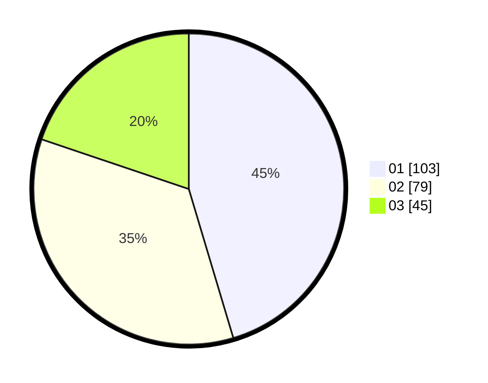

# Hasil

Hasil perolehan suara paslon dapat dilihat pada file paslon-01.txt, paslon-02.txt, dan paslon-03.txt.

Jika tidak ada, artinya data tersebut belum ada pada SIREKAP.

## Perolehan Suara

 * Paslon 01: **103**.
 * Paslon 02: **79**.
 * Paslon 03: **45**.

## Foto C Plano

https://sirekap-obj-formc.kpu.go.id/9779/pemilu/ppwp/31/74/01/10/03/3174011003125-20240214-191729--4fb949e4-9ec4-490f-bae4-d420ff108d87.jpg

https://sirekap-obj-formc.kpu.go.id/9779/pemilu/ppwp/31/74/01/10/03/3174011003125-20240214-190618--843dac2e-cdbe-4ac5-b785-c56e36f8f1c6.jpg

https://sirekap-obj-formc.kpu.go.id/9779/pemilu/ppwp/31/74/01/10/03/3174011003125-20240214-191832--775dac31-7f23-4029-97aa-8f7b74632749.jpg

## DATA PEMILIH TETAP

Jumlah pemilih dalam DPT: **258**.
 * L: **122**.
 * P: **136**.

## DATA PENGGUNA HAK PILIH

Jumlah pengguna hak pilih dalam DPT: **221**.
 * L: **105**.
 * P: **116**.

Jumlah pengguna hak pilih dalam DPTb: **6**.
 * L: **3**.
 * P: **3**.

Jumlah pengguna hak pilih dalam DPK: **4**.
 * L: **2**.
 * P: **2**.

Jumlah pengguna hak pilih: **231**.
 * L: **110**.
 * P: **121**.

## JUMLAH SUARA SAH DAN TIDAK SAH

JUMLAH SELURUH SUARA SAH: **227**.

JUMLAH SUARA TIDAK SAH: **4**.

JUMLAH SELURUH SUARA SAH DAN SUARA TIDAK SAH: **231**.
