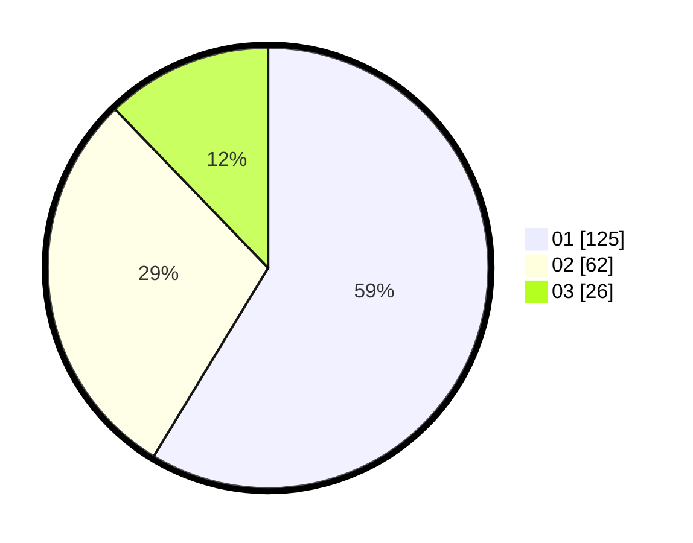

# Hasil

Hasil perolehan suara paslon dapat dilihat pada file paslon-01.txt, paslon-02.txt, dan paslon-03.txt.

Jika tidak ada, artinya data tersebut belum ada pada SIREKAP.

## Perolehan Suara

 * Paslon 01: **125**.
 * Paslon 02: **62**.
 * Paslon 03: **26**.

## Foto C Plano

https://sirekap-obj-formc.kpu.go.id/a8f9/pemilu/ppwp/31/74/01/10/04/3174011004002-20240216-043440--de920b57-32f9-447f-b0c9-c11adb9fee97.jpg

https://sirekap-obj-formc.kpu.go.id/a8f9/pemilu/ppwp/31/74/01/10/04/3174011004002-20240216-043442--29face3c-1f44-4130-ad4e-7b2dd84a4837.jpg

https://sirekap-obj-formc.kpu.go.id/a8f9/pemilu/ppwp/31/74/01/10/04/3174011004002-20240216-043441--50f978b4-5efd-422d-8512-814f3e442d6a.jpg

## DATA PEMILIH TETAP

Jumlah pemilih dalam DPT: **267**.
 * L: **131**.
 * P: **136**.

## DATA PENGGUNA HAK PILIH

Jumlah pengguna hak pilih dalam DPT: **205**.
 * L: **91**.
 * P: **114**.

Jumlah pengguna hak pilih dalam DPTb: **10**.
 * L: **5**.
 * P: **5**.

Jumlah pengguna hak pilih dalam DPK: **3**.
 * L: **1**.
 * P: **2**.

Jumlah pengguna hak pilih: **218**.
 * L: **97**.
 * P: **121**.

## JUMLAH SUARA SAH DAN TIDAK SAH

JUMLAH SELURUH SUARA SAH: **213**.

JUMLAH SUARA TIDAK SAH: **5**.

JUMLAH SELURUH SUARA SAH DAN SUARA TIDAK SAH: **218**.
