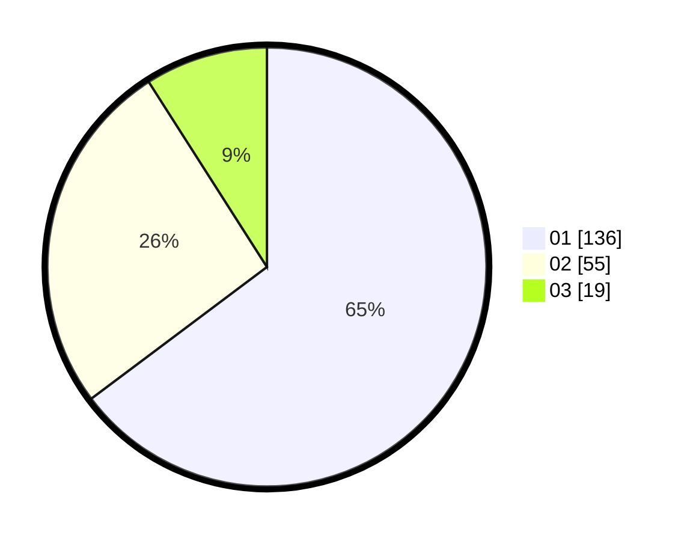

# Hasil

Hasil perolehan suara paslon dapat dilihat pada file paslon-01.txt, paslon-02.txt, dan paslon-03.txt.

Jika tidak ada, artinya data tersebut belum ada pada SIREKAP.

## Perolehan Suara

 * Paslon 01: **136**.
 * Paslon 02: **55**.
 * Paslon 03: **19**.

## Foto C Plano

https://sirekap-obj-formc.kpu.go.id/fc4f/pemilu/ppwp/31/74/01/10/04/3174011004003-20240216-135140--605ad321-66c9-42ca-aeed-db6f9cc07bb5.jpg

https://sirekap-obj-formc.kpu.go.id/fc4f/pemilu/ppwp/31/74/01/10/04/3174011004003-20240216-135141--cb972241-7097-4fb1-ab47-f60598b41f24.jpg

https://sirekap-obj-formc.kpu.go.id/fc4f/pemilu/ppwp/31/74/01/10/04/3174011004003-20240216-135140--43207778-1a98-43c3-855c-3130ae8aa3ef.jpg

## DATA PEMILIH TETAP

Jumlah pemilih dalam DPT: **256**.
 * L: **125**.
 * P: **131**.

## DATA PENGGUNA HAK PILIH

Jumlah pengguna hak pilih dalam DPT: **197**.
 * L: **92**.
 * P: **105**.

Jumlah pengguna hak pilih dalam DPTb: **10**.
 * L: **7**.
 * P: **3**.

Jumlah pengguna hak pilih dalam DPK: **3**.
 * L: **2**.
 * P: **1**.

Jumlah pengguna hak pilih: **210**.
 * L: **101**.
 * P: **109**.

## JUMLAH SUARA SAH DAN TIDAK SAH

JUMLAH SELURUH SUARA SAH: **210**.

JUMLAH SUARA TIDAK SAH: **0**.

JUMLAH SELURUH SUARA SAH DAN SUARA TIDAK SAH: **210**.
