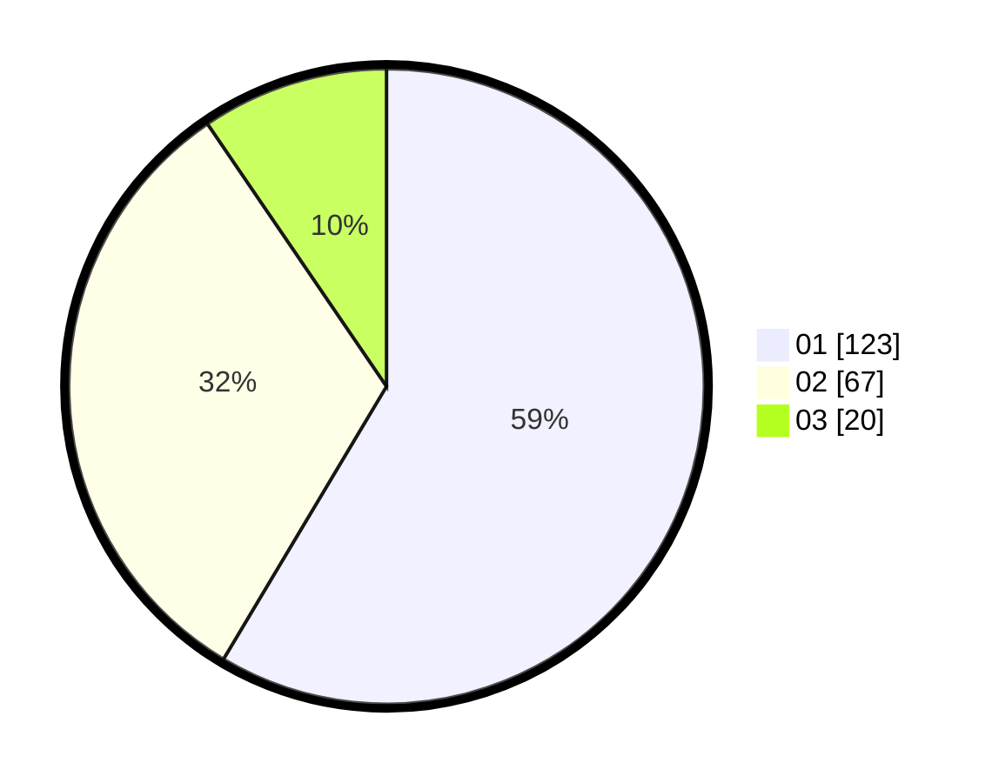

# Hasil

Hasil perolehan suara paslon dapat dilihat pada file paslon-01.txt, paslon-02.txt, dan paslon-03.txt.

Jika tidak ada, artinya data tersebut belum ada pada SIREKAP.

## Perolehan Suara

 * Paslon 01: **123**.
 * Paslon 02: **67**.
 * Paslon 03: **20**.

## Foto C Plano

https://sirekap-obj-formc.kpu.go.id/2508/pemilu/ppwp/31/74/01/10/04/3174011004011-20240214-195431--5a8b341a-4fc4-4a12-829a-b6a0592b5410.jpg

https://sirekap-obj-formc.kpu.go.id/2508/pemilu/ppwp/31/74/01/10/04/3174011004011-20240214-195611--46dcfa55-9946-47b1-8caf-dd69652fa73a.jpg

https://sirekap-obj-formc.kpu.go.id/2508/pemilu/ppwp/31/74/01/10/04/3174011004011-20240214-195727--a16848b4-9f0b-41ac-a3a7-eaeb91e97159.jpg

## DATA PEMILIH TETAP

Jumlah pemilih dalam DPT: **251**.
 * L: **130**.
 * P: **121**.

## DATA PENGGUNA HAK PILIH

Jumlah pengguna hak pilih dalam DPT: **208**.
 * L: **103**.
 * P: **105**.

Jumlah pengguna hak pilih dalam DPTb: **4**.
 * L: **3**.
 * P: **1**.

Jumlah pengguna hak pilih dalam DPK: **0**.
 * L: **0**.
 * P: **0**.

Jumlah pengguna hak pilih: **212**.
 * L: **106**.
 * P: **106**.

## JUMLAH SUARA SAH DAN TIDAK SAH

JUMLAH SELURUH SUARA SAH: **212**.

JUMLAH SUARA TIDAK SAH: **2**.

JUMLAH SELURUH SUARA SAH DAN SUARA TIDAK SAH: **214**.
