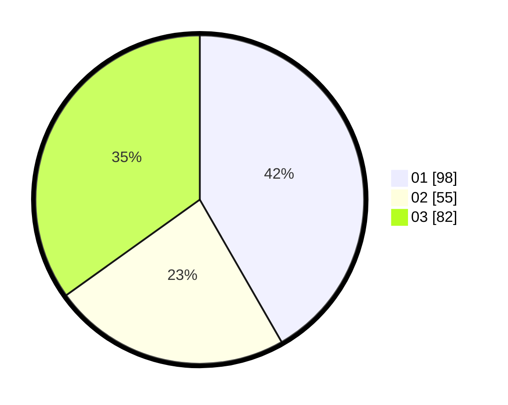

# Hasil

Hasil perolehan suara paslon dapat dilihat pada file paslon-01.txt, paslon-02.txt, dan paslon-03.txt.

Jika tidak ada, artinya data tersebut belum ada pada SIREKAP.

## Perolehan Suara

 * Paslon 01: **98**.
 * Paslon 02: **55**.
 * Paslon 03: **82**.

## Foto C Plano

https://sirekap-obj-formc.kpu.go.id/2396/pemilu/ppwp/31/74/01/10/04/3174011004018-20240214-221535--998d2a8d-2dd2-40bf-96fa-81bdfa7580f1.jpg

https://sirekap-obj-formc.kpu.go.id/2396/pemilu/ppwp/31/74/01/10/04/3174011004018-20240214-221538--cc233146-8f69-49af-a4f4-89ab75fb635b.jpg

https://sirekap-obj-formc.kpu.go.id/2396/pemilu/ppwp/31/74/01/10/04/3174011004018-20240214-221540--7b999a67-4150-4ca0-aa3b-5f837dbef0a8.jpg

## DATA PEMILIH TETAP

Jumlah pemilih dalam DPT: **274**.
 * L: **120**.
 * P: **154**.

## DATA PENGGUNA HAK PILIH

Jumlah pengguna hak pilih dalam DPT: **224**.
 * L: **97**.
 * P: **127**.

Jumlah pengguna hak pilih dalam DPTb: **10**.
 * L: **4**.
 * P: **6**.

Jumlah pengguna hak pilih dalam DPK: **5**.
 * L: **3**.
 * P: **2**.

Jumlah pengguna hak pilih: **239**.
 * L: **104**.
 * P: **135**.

## JUMLAH SUARA SAH DAN TIDAK SAH

JUMLAH SELURUH SUARA SAH: **235**.

JUMLAH SUARA TIDAK SAH: **4**.

JUMLAH SELURUH SUARA SAH DAN SUARA TIDAK SAH: **239**.
