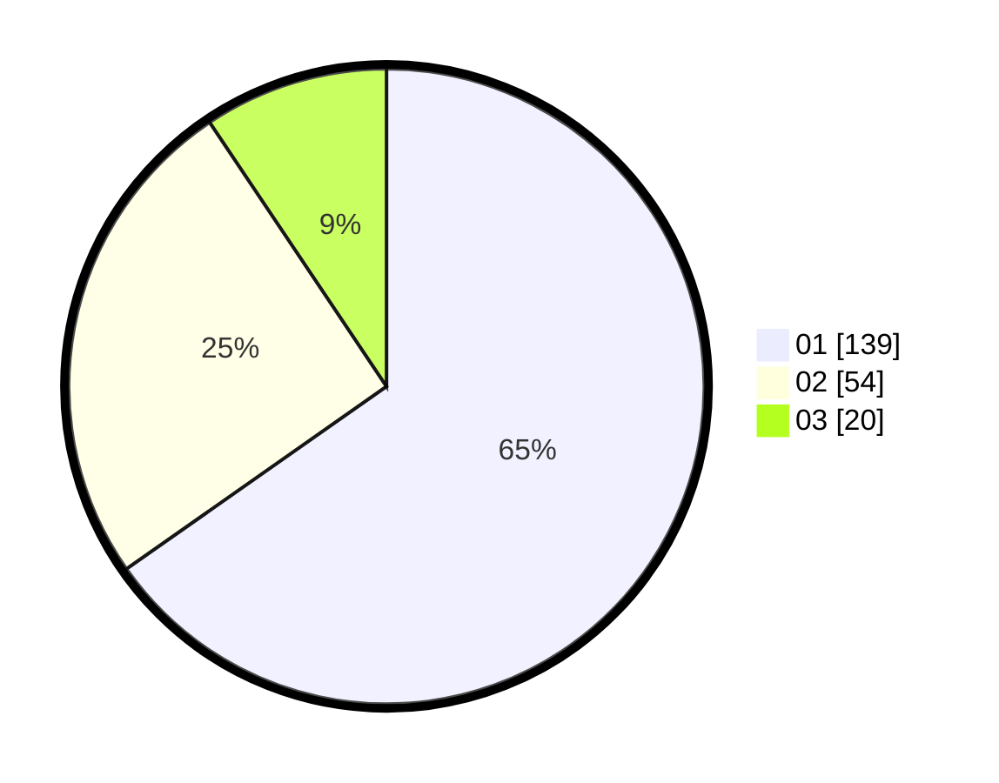

# Hasil

Hasil perolehan suara paslon dapat dilihat pada file paslon-01.txt, paslon-02.txt, dan paslon-03.txt.

Jika tidak ada, artinya data tersebut belum ada pada SIREKAP.

## Perolehan Suara

 * Paslon 01: **139**.
 * Paslon 02: **54**.
 * Paslon 03: **20**.

## Foto C Plano

https://sirekap-obj-formc.kpu.go.id/0a7c/pemilu/ppwp/31/74/01/10/04/3174011004025-20240214-193423--ada20f22-e5ed-449e-b6cf-35b11ac27bf1.jpg

https://sirekap-obj-formc.kpu.go.id/0a7c/pemilu/ppwp/31/74/01/10/04/3174011004025-20240214-193429--c69b0031-f58f-4085-91f7-29a46e366ec9.jpg

https://sirekap-obj-formc.kpu.go.id/0a7c/pemilu/ppwp/31/74/01/10/04/3174011004025-20240214-193429--b34bb96d-364b-463e-9352-959769483576.jpg

## DATA PEMILIH TETAP

Jumlah pemilih dalam DPT: **262**.
 * L: **133**.
 * P: **129**.

## DATA PENGGUNA HAK PILIH

Jumlah pengguna hak pilih dalam DPT: **199**.
 * L: **95**.
 * P: **104**.

Jumlah pengguna hak pilih dalam DPTb: **14**.
 * L: **6**.
 * P: **8**.

Jumlah pengguna hak pilih dalam DPK: **2**.
 * L: **1**.
 * P: **1**.

Jumlah pengguna hak pilih: **215**.
 * L: **102**.
 * P: **113**.

## JUMLAH SUARA SAH DAN TIDAK SAH

JUMLAH SELURUH SUARA SAH: **213**.

JUMLAH SUARA TIDAK SAH: **2**.

JUMLAH SELURUH SUARA SAH DAN SUARA TIDAK SAH: **215**.
