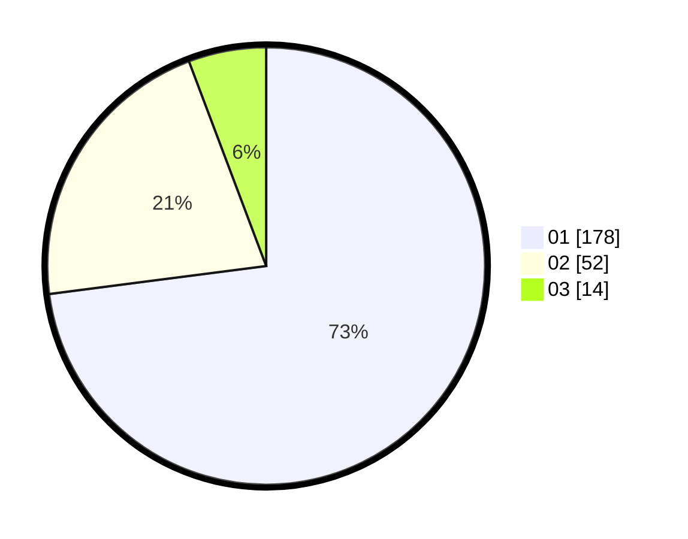

# Hasil

Hasil perolehan suara paslon dapat dilihat pada file paslon-01.txt, paslon-02.txt, dan paslon-03.txt.

Jika tidak ada, artinya data tersebut belum ada pada SIREKAP.

## Perolehan Suara

 * Paslon 01: **178**.
 * Paslon 02: **52**.
 * Paslon 03: **14**.

## Foto C Plano

https://sirekap-obj-formc.kpu.go.id/80e7/pemilu/ppwp/31/74/01/10/04/3174011004034-20240214-185706--f6b66294-03fb-4e7c-8501-eb26f07856eb.jpg

https://sirekap-obj-formc.kpu.go.id/80e7/pemilu/ppwp/31/74/01/10/04/3174011004034-20240214-185717--23d12f8a-8f2c-4994-b21d-6b246b84780d.jpg

https://sirekap-obj-formc.kpu.go.id/80e7/pemilu/ppwp/31/74/01/10/04/3174011004034-20240214-214626--569aa622-38c1-4854-ab11-65a7ca7222a0.jpg

## DATA PEMILIH TETAP

Jumlah pemilih dalam DPT: **280**.
 * L: **132**.
 * P: **148**.

## DATA PENGGUNA HAK PILIH

Jumlah pengguna hak pilih dalam DPT: **246**.
 * L: **117**.
 * P: **129**.

Jumlah pengguna hak pilih dalam DPTb: **1**.
 * L: **0**.
 * P: **1**.

Jumlah pengguna hak pilih dalam DPK: **1**.
 * L: **1**.
 * P: **0**.

Jumlah pengguna hak pilih: **248**.
 * L: **118**.
 * P: **130**.

## JUMLAH SUARA SAH DAN TIDAK SAH

JUMLAH SELURUH SUARA SAH: **244**.

JUMLAH SUARA TIDAK SAH: **4**.

JUMLAH SELURUH SUARA SAH DAN SUARA TIDAK SAH: **248**.
