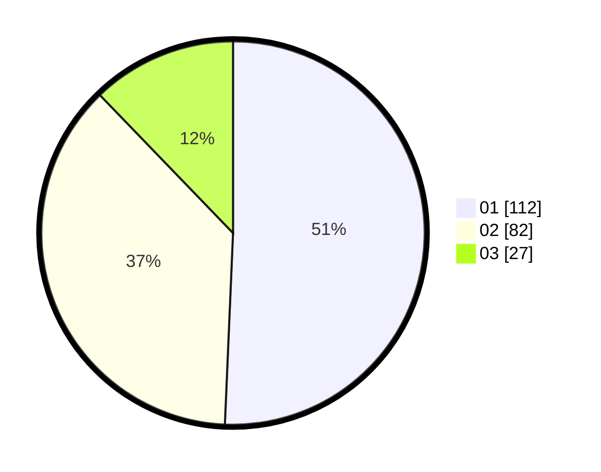

# Hasil

Hasil perolehan suara paslon dapat dilihat pada file paslon-01.txt, paslon-02.txt, dan paslon-03.txt.

Jika tidak ada, artinya data tersebut belum ada pada SIREKAP.

## Perolehan Suara

 * Paslon 01: **112**.
 * Paslon 02: **82**.
 * Paslon 03: **27**.

## Foto C Plano

https://sirekap-obj-formc.kpu.go.id/df7d/pemilu/ppwp/31/74/01/10/04/3174011004049-20240218-191111--c809f6ce-d96a-4a17-9134-ec97461c9bb8.jpg

https://sirekap-obj-formc.kpu.go.id/df7d/pemilu/ppwp/31/74/01/10/04/3174011004049-20240218-191122--69aa73c1-1cb0-4f9d-91ee-8917b5e81a60.jpg

https://sirekap-obj-formc.kpu.go.id/df7d/pemilu/ppwp/31/74/01/10/04/3174011004049-20240218-191126--33e8bdb8-c523-4a2e-b773-ec233f410cf5.jpg

## DATA PEMILIH TETAP

Jumlah pemilih dalam DPT: **268**.
 * L: **138**.
 * P: **130**.

## DATA PENGGUNA HAK PILIH

Jumlah pengguna hak pilih dalam DPT: **216**.
 * L: **107**.
 * P: **109**.

Jumlah pengguna hak pilih dalam DPTb: **2**.
 * L: **0**.
 * P: **2**.

Jumlah pengguna hak pilih dalam DPK: **5**.
 * L: **3**.
 * P: **2**.

Jumlah pengguna hak pilih: **223**.
 * L: **110**.
 * P: **113**.

## JUMLAH SUARA SAH DAN TIDAK SAH

JUMLAH SELURUH SUARA SAH: **221**.

JUMLAH SUARA TIDAK SAH: **2**.

JUMLAH SELURUH SUARA SAH DAN SUARA TIDAK SAH: **223**.
