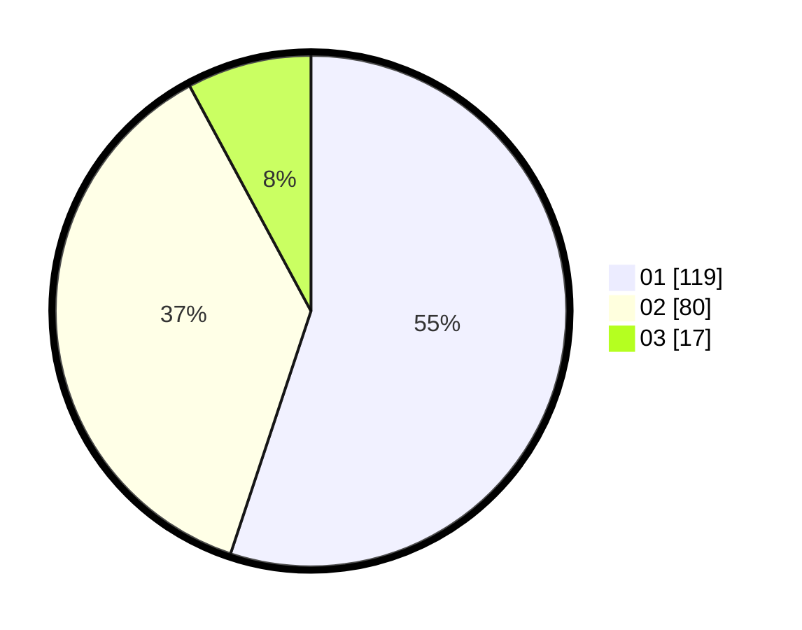

# Hasil

Hasil perolehan suara paslon dapat dilihat pada file paslon-01.txt, paslon-02.txt, dan paslon-03.txt.

Jika tidak ada, artinya data tersebut belum ada pada SIREKAP.

## Perolehan Suara

 * Paslon 01: **119**.
 * Paslon 02: **80**.
 * Paslon 03: **17**.

## Foto C Plano

https://sirekap-obj-formc.kpu.go.id/f96c/pemilu/ppwp/31/74/01/10/04/3174011004051-20240215-220130--1f452df6-6b36-41ad-b8b4-188796105a19.jpg

https://sirekap-obj-formc.kpu.go.id/f96c/pemilu/ppwp/31/74/01/10/04/3174011004051-20240215-203607--60f71ed1-de3a-4567-bc94-c9c4c64340a6.jpg

https://sirekap-obj-formc.kpu.go.id/f96c/pemilu/ppwp/31/74/01/10/04/3174011004051-20240215-215853--e86b176c-c32d-43d2-bcf1-127eb745fe4b.jpg

## DATA PEMILIH TETAP

Jumlah pemilih dalam DPT: **272**.
 * L: **136**.
 * P: **136**.

## DATA PENGGUNA HAK PILIH

Jumlah pengguna hak pilih dalam DPT: **210**.
 * L: **101**.
 * P: **109**.

Jumlah pengguna hak pilih dalam DPTb: **2**.
 * L: **1**.
 * P: **1**.

Jumlah pengguna hak pilih dalam DPK: **5**.
 * L: **4**.
 * P: **1**.

Jumlah pengguna hak pilih: **217**.
 * L: **106**.
 * P: **111**.

## JUMLAH SUARA SAH DAN TIDAK SAH

JUMLAH SELURUH SUARA SAH: **216**.

JUMLAH SUARA TIDAK SAH: **1**.

JUMLAH SELURUH SUARA SAH DAN SUARA TIDAK SAH: **1**.
