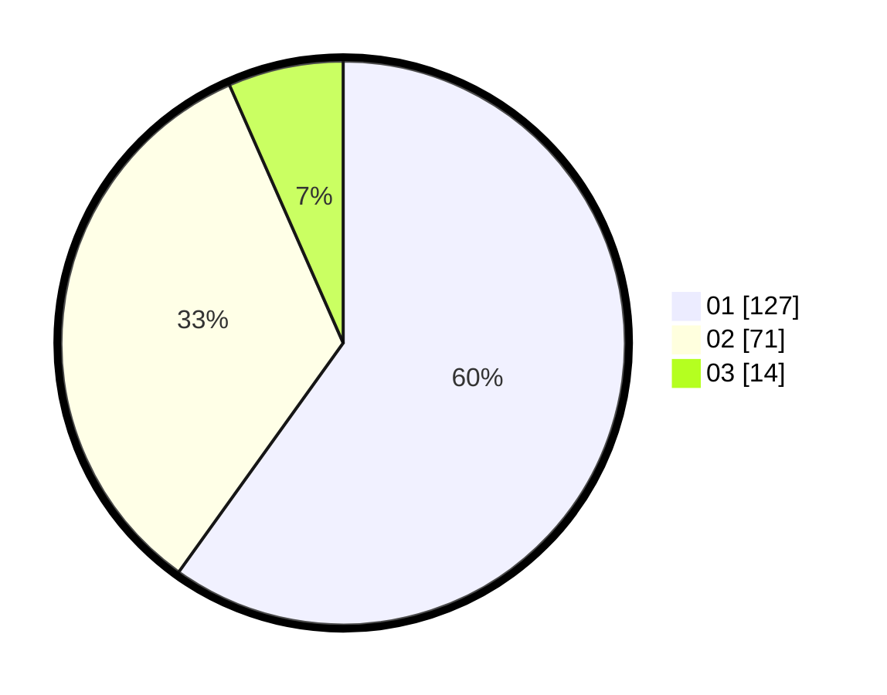

# Hasil

Hasil perolehan suara paslon dapat dilihat pada file paslon-01.txt, paslon-02.txt, dan paslon-03.txt.

Jika tidak ada, artinya data tersebut belum ada pada SIREKAP.

## Perolehan Suara

 * Paslon 01: **127**.
 * Paslon 02: **71**.
 * Paslon 03: **14**.

## Foto C Plano

https://sirekap-obj-formc.kpu.go.id/8d97/pemilu/ppwp/31/74/01/10/04/3174011004052-20240214-155353--cf3193d6-1aa9-4f2f-a964-9d2b8abb2373.jpg

https://sirekap-obj-formc.kpu.go.id/8d97/pemilu/ppwp/31/74/01/10/04/3174011004052-20240214-155435--a6a296fc-4cf6-4de3-b7dd-656eb75bd695.jpg

https://sirekap-obj-formc.kpu.go.id/8d97/pemilu/ppwp/31/74/01/10/04/3174011004052-20240215-212355--827658d9-89fd-475c-9f06-170c835a5f87.jpg

## DATA PEMILIH TETAP

Jumlah pemilih dalam DPT: **267**.
 * L: **130**.
 * P: **137**.

## DATA PENGGUNA HAK PILIH

Jumlah pengguna hak pilih dalam DPT: **211**.
 * L: **107**.
 * P: **104**.

Jumlah pengguna hak pilih dalam DPTb: **1**.
 * L: **1**.
 * P: **0**.

Jumlah pengguna hak pilih dalam DPK: **0**.
 * L: **0**.
 * P: **0**.

Jumlah pengguna hak pilih: **212**.
 * L: **108**.
 * P: **104**.

## JUMLAH SUARA SAH DAN TIDAK SAH

JUMLAH SELURUH SUARA SAH: **212**.

JUMLAH SUARA TIDAK SAH: **0**.

JUMLAH SELURUH SUARA SAH DAN SUARA TIDAK SAH: **0**.
