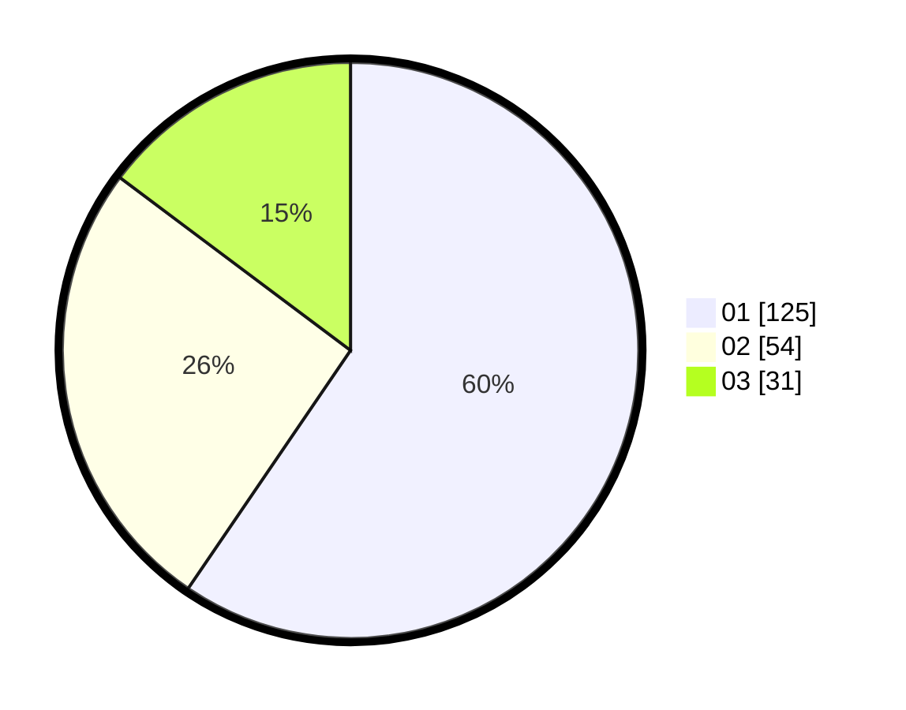

# Hasil

Hasil perolehan suara paslon dapat dilihat pada file paslon-01.txt, paslon-02.txt, dan paslon-03.txt.

Jika tidak ada, artinya data tersebut belum ada pada SIREKAP.

## Perolehan Suara

 * Paslon 01: **125**.
 * Paslon 02: **54**.
 * Paslon 03: **31**.

## Foto C Plano

https://sirekap-obj-formc.kpu.go.id/9f37/pemilu/ppwp/31/74/01/10/04/3174011004055-20240216-064402--ab11f853-3e4f-4446-91bc-22b019219f70.jpg

https://sirekap-obj-formc.kpu.go.id/9f37/pemilu/ppwp/31/74/01/10/04/3174011004055-20240215-221025--ea3e936e-4e98-4f2d-a97d-9cf662a011e0.jpg

https://sirekap-obj-formc.kpu.go.id/9f37/pemilu/ppwp/31/74/01/10/04/3174011004055-20240216-065227--20e5c979-3e78-4480-9631-53f70099a07d.jpg

## DATA PEMILIH TETAP

Jumlah pemilih dalam DPT: **255**.
 * L: **121**.
 * P: **134**.

## DATA PENGGUNA HAK PILIH

Jumlah pengguna hak pilih dalam DPT: **201**.
 * L: **86**.
 * P: **115**.

Jumlah pengguna hak pilih dalam DPTb: **6**.
 * L: **3**.
 * P: **3**.

Jumlah pengguna hak pilih dalam DPK: **4**.
 * L: **2**.
 * P: **2**.

Jumlah pengguna hak pilih: **211**.
 * L: **91**.
 * P: **120**.

## JUMLAH SUARA SAH DAN TIDAK SAH

JUMLAH SELURUH SUARA SAH: **210**.

JUMLAH SUARA TIDAK SAH: **1**.

JUMLAH SELURUH SUARA SAH DAN SUARA TIDAK SAH: **211**.
