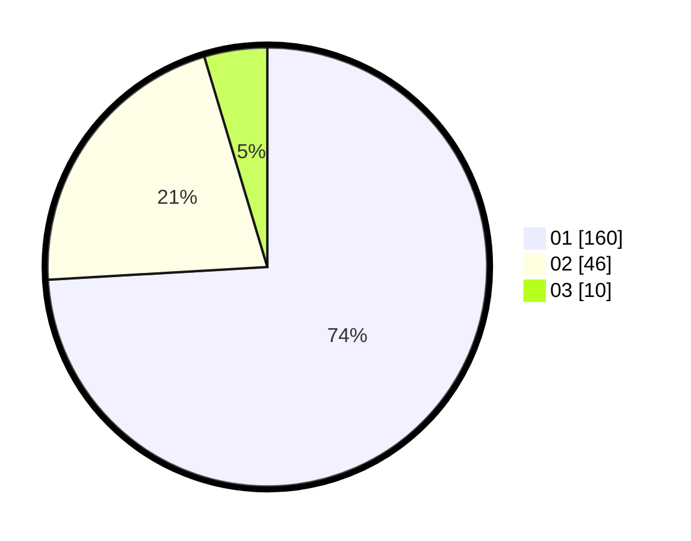

# Hasil

Hasil perolehan suara paslon dapat dilihat pada file paslon-01.txt, paslon-02.txt, dan paslon-03.txt.

Jika tidak ada, artinya data tersebut belum ada pada SIREKAP.

## Perolehan Suara

 * Paslon 01: **160**.
 * Paslon 02: **46**.
 * Paslon 03: **10**.

## Foto C Plano

https://sirekap-obj-formc.kpu.go.id/6405/pemilu/ppwp/31/74/01/10/04/3174011004061-20240214-184939--2648442b-d8c9-40b5-9332-f6dc74f299df.jpg

https://sirekap-obj-formc.kpu.go.id/6405/pemilu/ppwp/31/74/01/10/04/3174011004061-20240214-194245--c51f3771-66a3-41a2-bf60-ff88f2546fb9.jpg

https://sirekap-obj-formc.kpu.go.id/6405/pemilu/ppwp/31/74/01/10/04/3174011004061-20240214-185338--5410eef7-abd0-4b3e-977f-196861d7f410.jpg

## DATA PEMILIH TETAP

Jumlah pemilih dalam DPT: **256**.
 * L: **136**.
 * P: **120**.

## DATA PENGGUNA HAK PILIH

Jumlah pengguna hak pilih dalam DPT: **218**.
 * L: **113**.
 * P: **105**.

Jumlah pengguna hak pilih dalam DPTb: **1**.
 * L: **1**.
 * P: **0**.

Jumlah pengguna hak pilih dalam DPK: **0**.
 * L: **0**.
 * P: **0**.

Jumlah pengguna hak pilih: **219**.
 * L: **114**.
 * P: **105**.

## JUMLAH SUARA SAH DAN TIDAK SAH

JUMLAH SELURUH SUARA SAH: **216**.

JUMLAH SUARA TIDAK SAH: **3**.

JUMLAH SELURUH SUARA SAH DAN SUARA TIDAK SAH: **219**.
