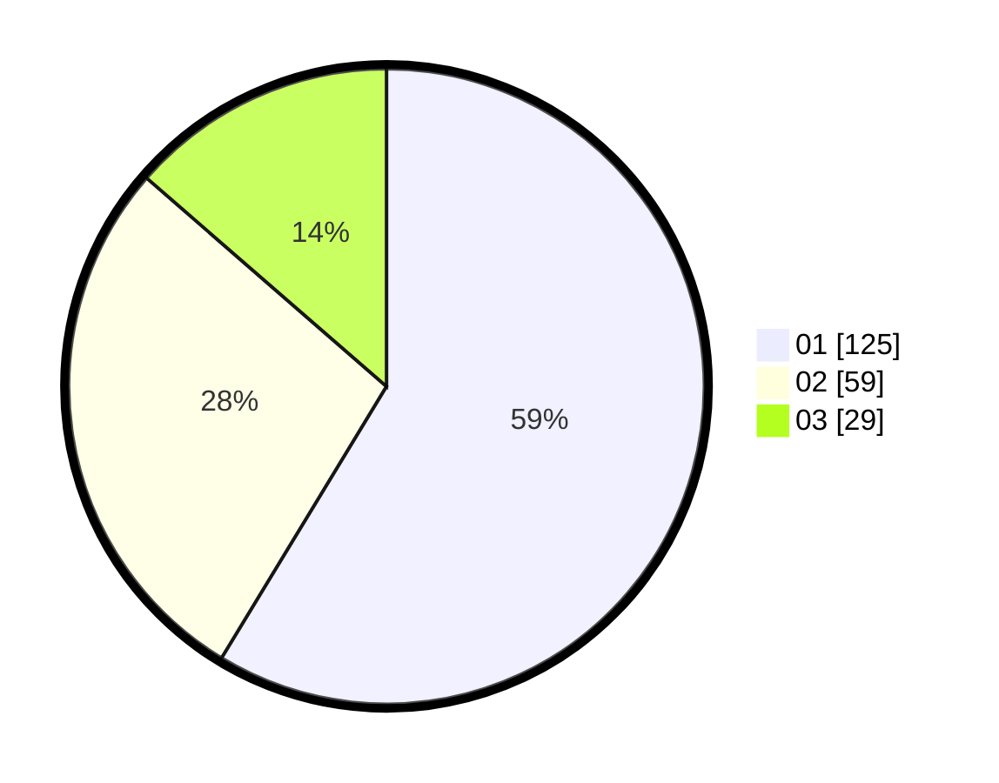

# Hasil

Hasil perolehan suara paslon dapat dilihat pada file paslon-01.txt, paslon-02.txt, dan paslon-03.txt.

Jika tidak ada, artinya data tersebut belum ada pada SIREKAP.

## Perolehan Suara

 * Paslon 01: **125**.
 * Paslon 02: **59**.
 * Paslon 03: **29**.

## Foto C Plano

https://sirekap-obj-formc.kpu.go.id/6dbc/pemilu/ppwp/31/74/01/10/04/3174011004080-20240216-105258--79541a7e-30c4-461f-b953-fc48b70cf500.jpg

https://sirekap-obj-formc.kpu.go.id/6dbc/pemilu/ppwp/31/74/01/10/04/3174011004080-20240218-211620--c0e55bed-c302-4f85-befa-b3e042517bbf.jpg

https://sirekap-obj-formc.kpu.go.id/6dbc/pemilu/ppwp/31/74/01/10/04/3174011004080-20240215-004726--588a28bb-43db-40d7-a71e-4ce8e887d9c0.jpg
