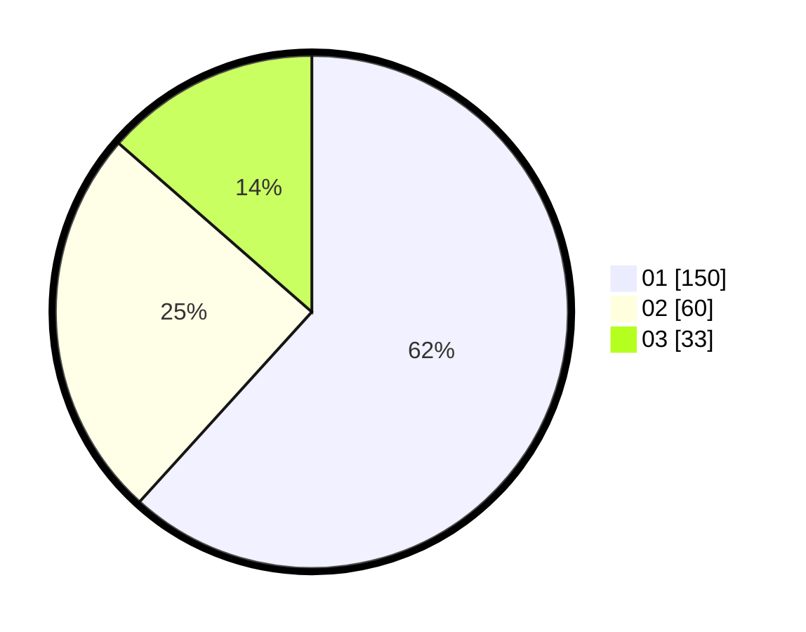

# Hasil

Hasil perolehan suara paslon dapat dilihat pada file paslon-01.txt, paslon-02.txt, dan paslon-03.txt.

Jika tidak ada, artinya data tersebut belum ada pada SIREKAP.

## Perolehan Suara

 * Paslon 01: **150**.
 * Paslon 02: **60**.
 * Paslon 03: **33**.

## Foto C Plano

https://sirekap-obj-formc.kpu.go.id/81d8/pemilu/ppwp/31/74/01/10/04/3174011004083-20240214-191314--a24a05b8-be0d-48e1-a656-1d2b3f392f46.jpg

https://sirekap-obj-formc.kpu.go.id/81d8/pemilu/ppwp/31/74/01/10/04/3174011004083-20240214-191356--82157d81-9896-4398-b270-96f118802b45.jpg

https://sirekap-obj-formc.kpu.go.id/81d8/pemilu/ppwp/31/74/01/10/04/3174011004083-20240214-191444--177a353c-1537-4be5-9659-5c73acac740b.jpg

## DATA PEMILIH TETAP

Jumlah pemilih dalam DPT: **272**.
 * L: **141**.
 * P: **131**.

## DATA PENGGUNA HAK PILIH

Jumlah pengguna hak pilih dalam DPT: **241**.
 * L: **118**.
 * P: **123**.

Jumlah pengguna hak pilih dalam DPTb: **2**.
 * L: **1**.
 * P: **1**.

Jumlah pengguna hak pilih dalam DPK: **1**.
 * L: **0**.
 * P: **1**.

Jumlah pengguna hak pilih: **244**.
 * L: **119**.
 * P: **125**.

## JUMLAH SUARA SAH DAN TIDAK SAH

JUMLAH SELURUH SUARA SAH: **243**.

JUMLAH SUARA TIDAK SAH: **1**.

JUMLAH SELURUH SUARA SAH DAN SUARA TIDAK SAH: **244**.
