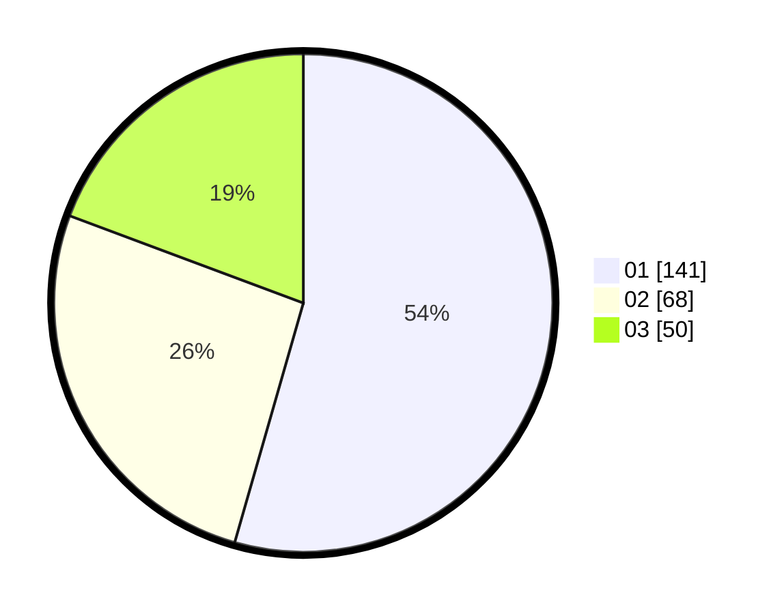

# Hasil

Hasil perolehan suara paslon dapat dilihat pada file paslon-01.txt, paslon-02.txt, dan paslon-03.txt.

Jika tidak ada, artinya data tersebut belum ada pada SIREKAP.

## Perolehan Suara

 * Paslon 01: **141**.
 * Paslon 02: **68**.
 * Paslon 03: **50**.

## Foto C Plano

https://sirekap-obj-formc.kpu.go.id/1eec/pemilu/ppwp/31/74/01/10/04/3174011004115-20240214-193017--c44958e9-ff8b-44c7-9678-0c10543c2124.jpg

https://sirekap-obj-formc.kpu.go.id/1eec/pemilu/ppwp/31/74/01/10/04/3174011004115-20240214-224751--a5953872-6775-4858-a188-0d8907fefe2d.jpg

https://sirekap-obj-formc.kpu.go.id/1eec/pemilu/ppwp/31/74/01/10/04/3174011004115-20240214-193250--507d1a5e-2b8f-48a6-9dd5-bb1b128336b1.jpg
