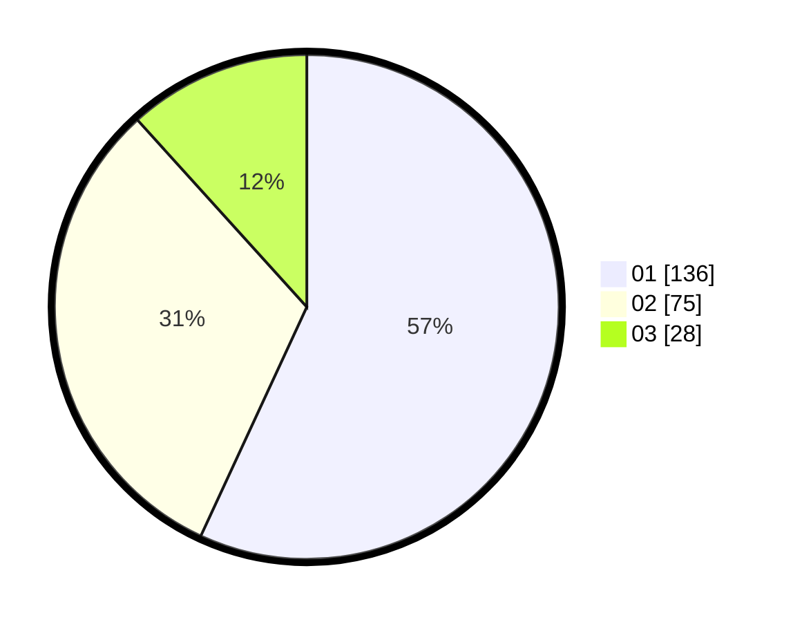

# Hasil

Hasil perolehan suara paslon dapat dilihat pada file paslon-01.txt, paslon-02.txt, dan paslon-03.txt.

Jika tidak ada, artinya data tersebut belum ada pada SIREKAP.

## Perolehan Suara

 * Paslon 01: **136**.
 * Paslon 02: **75**.
 * Paslon 03: **28**.

## Foto C Plano

https://sirekap-obj-formc.kpu.go.id/dba3/pemilu/ppwp/31/74/01/10/04/3174011004117-20240216-010513--c038eaea-3f7b-426e-a000-186a5f1f4e10.jpg

https://sirekap-obj-formc.kpu.go.id/dba3/pemilu/ppwp/31/74/01/10/04/3174011004117-20240216-010515--95f49e88-761b-426c-8f11-506a6139e995.jpg

https://sirekap-obj-formc.kpu.go.id/dba3/pemilu/ppwp/31/74/01/10/04/3174011004117-20240216-010513--e853b7c5-ff02-4583-a1b9-3af5f670b000.jpg

## DATA PEMILIH TETAP

Jumlah pemilih dalam DPT: **282**.
 * L: **139**.
 * P: **143**.

## DATA PENGGUNA HAK PILIH

Jumlah pengguna hak pilih dalam DPT: **223**.
 * L: **117**.
 * P: **106**.

Jumlah pengguna hak pilih dalam DPTb: **18**.
 * L: **5**.
 * P: **13**.

Jumlah pengguna hak pilih dalam DPK: **2**.
 * L: **1**.
 * P: **1**.

Jumlah pengguna hak pilih: **243**.
 * L: **123**.
 * P: **120**.

## JUMLAH SUARA SAH DAN TIDAK SAH

JUMLAH SELURUH SUARA SAH: **239**.

JUMLAH SUARA TIDAK SAH: **4**.

JUMLAH SELURUH SUARA SAH DAN SUARA TIDAK SAH: **243**.
