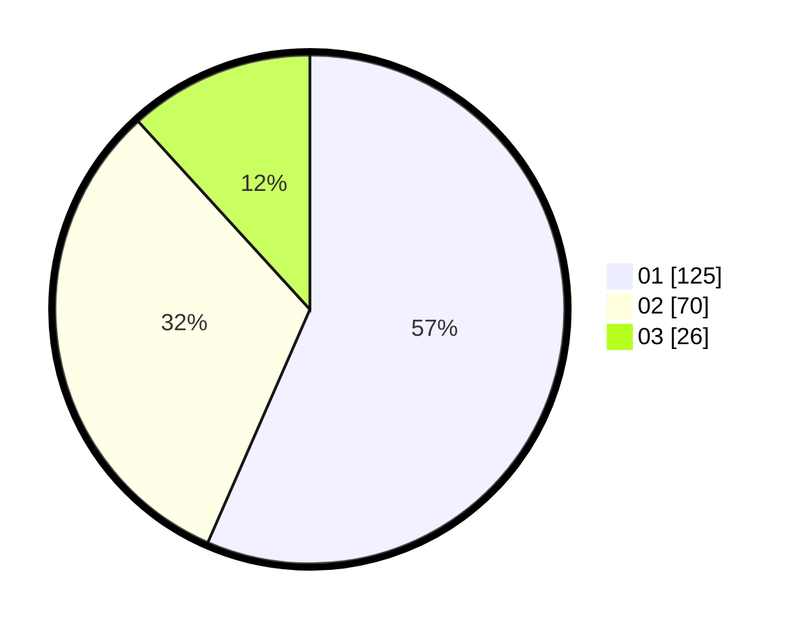

# Hasil

Hasil perolehan suara paslon dapat dilihat pada file paslon-01.txt, paslon-02.txt, dan paslon-03.txt.

Jika tidak ada, artinya data tersebut belum ada pada SIREKAP.

## Perolehan Suara

 * Paslon 01: **125**.
 * Paslon 02: **70**.
 * Paslon 03: **26**.

## Foto C Plano

https://sirekap-obj-formc.kpu.go.id/2c47/pemilu/ppwp/31/74/01/10/05/3174011005015-20240216-134600--06a5c293-9a08-4647-8208-ceeed37a3cc1.jpg

https://sirekap-obj-formc.kpu.go.id/2c47/pemilu/ppwp/31/74/01/10/05/3174011005015-20240216-134602--ce17a8d9-d2b9-4e9a-acea-c00adb38cfeb.jpg

https://sirekap-obj-formc.kpu.go.id/2c47/pemilu/ppwp/31/74/01/10/05/3174011005015-20240216-134601--2d4fdd79-793e-4a5b-a7cf-4894d3d1e9c0.jpg

## DATA PEMILIH TETAP

Jumlah pemilih dalam DPT: **278**.
 * L: **138**.
 * P: **140**.

## DATA PENGGUNA HAK PILIH

Jumlah pengguna hak pilih dalam DPT: **220**.
 * L: **105**.
 * P: **115**.

Jumlah pengguna hak pilih dalam DPTb: **1**.
 * L: **1**.
 * P: **0**.

Jumlah pengguna hak pilih dalam DPK: **1**.
 * L: **1**.
 * P: **0**.

Jumlah pengguna hak pilih: **222**.
 * L: **107**.
 * P: **115**.

## JUMLAH SUARA SAH DAN TIDAK SAH

JUMLAH SELURUH SUARA SAH: **221**.

JUMLAH SUARA TIDAK SAH: **1**.

JUMLAH SELURUH SUARA SAH DAN SUARA TIDAK SAH: **222**.
