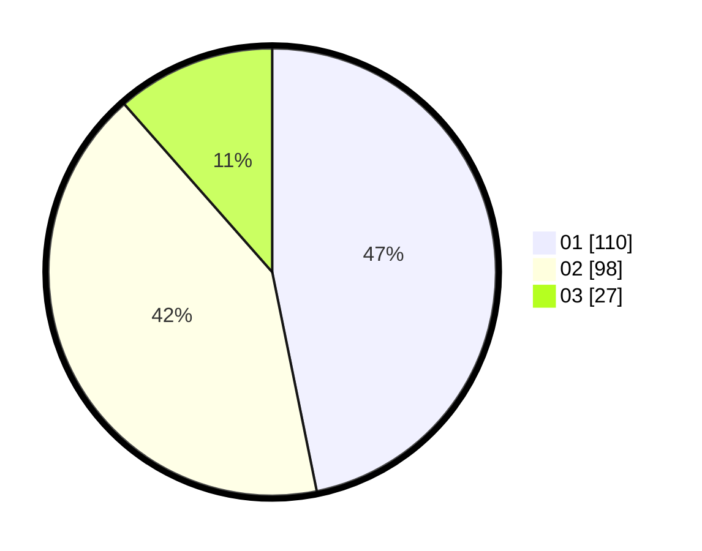

# Hasil

Hasil perolehan suara paslon dapat dilihat pada file paslon-01.txt, paslon-02.txt, dan paslon-03.txt.

Jika tidak ada, artinya data tersebut belum ada pada SIREKAP.

## Perolehan Suara

 * Paslon 01: **110**.
 * Paslon 02: **98**.
 * Paslon 03: **27**.

## Foto C Plano

https://sirekap-obj-formc.kpu.go.id/8381/pemilu/ppwp/31/74/01/10/05/3174011005022-20240214-231728--a2d1442d-6c69-4159-9805-33549b54a11f.jpg

https://sirekap-obj-formc.kpu.go.id/8381/pemilu/ppwp/31/74/01/10/05/3174011005022-20240214-232022--0ead9a42-c9ba-496e-a5ff-01c5dc1823e4.jpg

https://sirekap-obj-formc.kpu.go.id/8381/pemilu/ppwp/31/74/01/10/05/3174011005022-20240214-232216--14ae2b6b-087e-4916-8816-d02b4054d40d.jpg

## DATA PEMILIH TETAP

Jumlah pemilih dalam DPT: **280**.
 * L: **137**.
 * P: **143**.

## DATA PENGGUNA HAK PILIH

Jumlah pengguna hak pilih dalam DPT: **233**.
 * L: **110**.
 * P: **123**.

Jumlah pengguna hak pilih dalam DPTb: **2**.
 * L: **2**.
 * P: **0**.

Jumlah pengguna hak pilih dalam DPK: **1**.
 * L: **1**.
 * P: **0**.

Jumlah pengguna hak pilih: **236**.
 * L: **113**.
 * P: **123**.

## JUMLAH SUARA SAH DAN TIDAK SAH

JUMLAH SELURUH SUARA SAH: **235**.

JUMLAH SUARA TIDAK SAH: **1**.

JUMLAH SELURUH SUARA SAH DAN SUARA TIDAK SAH: **236**.
