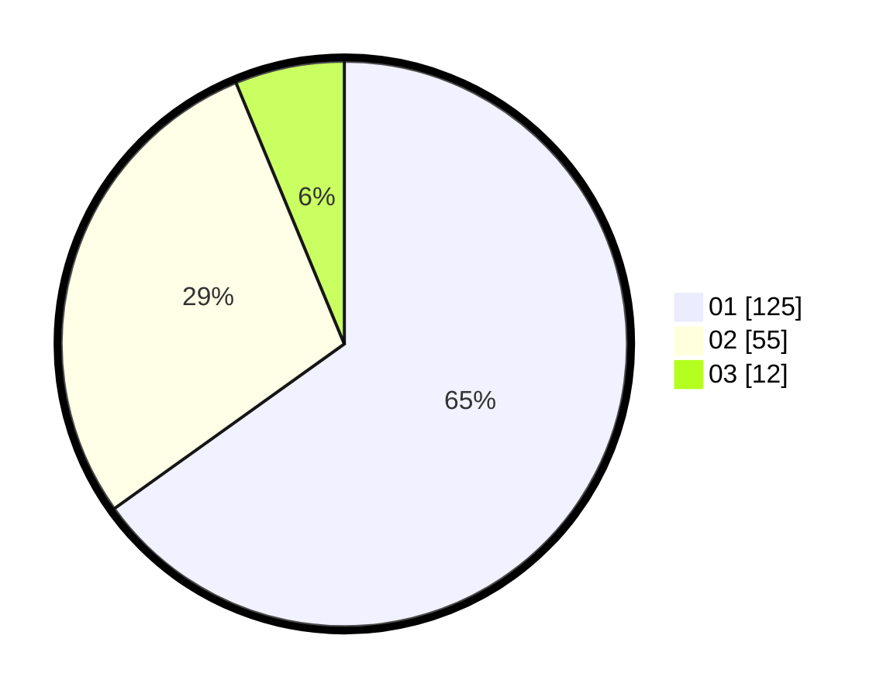

# Hasil

Hasil perolehan suara paslon dapat dilihat pada file paslon-01.txt, paslon-02.txt, dan paslon-03.txt.

Jika tidak ada, artinya data tersebut belum ada pada SIREKAP.

## Perolehan Suara

 * Paslon 01: **125**.
 * Paslon 02: **55**.
 * Paslon 03: **12**.

## Foto C Plano

https://sirekap-obj-formc.kpu.go.id/d04f/pemilu/ppwp/31/74/01/10/05/3174011005034-20240216-180224--0ccb0a1f-6e63-4b3d-8a19-161eb3df82c6.jpg

https://sirekap-obj-formc.kpu.go.id/d04f/pemilu/ppwp/31/74/01/10/05/3174011005034-20240216-180225--d2a3af5d-e10e-4ef8-9bd3-54822da379b3.jpg

https://sirekap-obj-formc.kpu.go.id/d04f/pemilu/ppwp/31/74/01/10/05/3174011005034-20240216-180225--4e33e050-175b-4eba-9767-c466e224e878.jpg

## DATA PEMILIH TETAP

Jumlah pemilih dalam DPT: **238**.
 * L: **113**.
 * P: **125**.

## DATA PENGGUNA HAK PILIH

Jumlah pengguna hak pilih dalam DPT: **193**.
 * L: **94**.
 * P: **99**.

Jumlah pengguna hak pilih dalam DPTb: **2**.
 * L: **0**.
 * P: **2**.

Jumlah pengguna hak pilih dalam DPK: **2**.
 * L: **1**.
 * P: **1**.

Jumlah pengguna hak pilih: **197**.
 * L: **95**.
 * P: **102**.

## JUMLAH SUARA SAH DAN TIDAK SAH

JUMLAH SELURUH SUARA SAH: **192**.

JUMLAH SUARA TIDAK SAH: **4**.

JUMLAH SELURUH SUARA SAH DAN SUARA TIDAK SAH: **196**.
