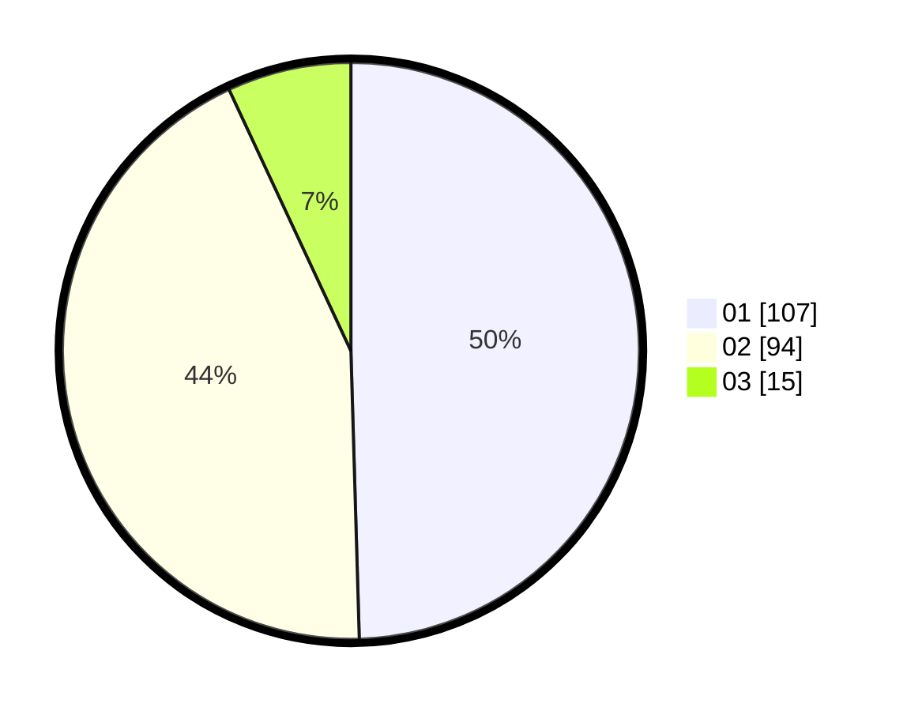

# Hasil

Hasil perolehan suara paslon dapat dilihat pada file paslon-01.txt, paslon-02.txt, dan paslon-03.txt.

Jika tidak ada, artinya data tersebut belum ada pada SIREKAP.

## Perolehan Suara

 * Paslon 01: **107**.
 * Paslon 02: **94**.
 * Paslon 03: **15**.

## Foto C Plano

https://sirekap-obj-formc.kpu.go.id/84ef/pemilu/ppwp/31/74/01/10/05/3174011005036-20240214-190619--24b0bd61-97bb-4331-a5c8-11af064b883c.jpg

https://sirekap-obj-formc.kpu.go.id/84ef/pemilu/ppwp/31/74/01/10/05/3174011005036-20240214-192141--7cac6fa0-5270-47e1-93dc-cd196b0582ed.jpg

https://sirekap-obj-formc.kpu.go.id/84ef/pemilu/ppwp/31/74/01/10/05/3174011005036-20240214-190422--d805fd08-336c-4f3e-bd98-9b88aa701bff.jpg

## DATA PEMILIH TETAP

Jumlah pemilih dalam DPT: **266**.
 * L: **130**.
 * P: **136**.

## DATA PENGGUNA HAK PILIH

Jumlah pengguna hak pilih dalam DPT: **218**.
 * L: **100**.
 * P: **118**.

Jumlah pengguna hak pilih dalam DPTb: **1**.
 * L: **0**.
 * P: **1**.

Jumlah pengguna hak pilih dalam DPK: **0**.
 * L: **0**.
 * P: **0**.

Jumlah pengguna hak pilih: **219**.
 * L: **100**.
 * P: **119**.

## JUMLAH SUARA SAH DAN TIDAK SAH

JUMLAH SELURUH SUARA SAH: **216**.

JUMLAH SUARA TIDAK SAH: **3**.

JUMLAH SELURUH SUARA SAH DAN SUARA TIDAK SAH: **219**.
