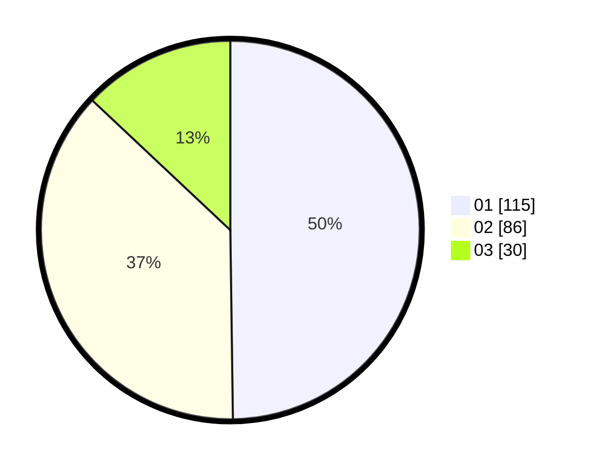

# Hasil

Hasil perolehan suara paslon dapat dilihat pada file paslon-01.txt, paslon-02.txt, dan paslon-03.txt.

Jika tidak ada, artinya data tersebut belum ada pada SIREKAP.

## Perolehan Suara

 * Paslon 01: **115**.
 * Paslon 02: **86**.
 * Paslon 03: **30**.

## Foto C Plano

https://sirekap-obj-formc.kpu.go.id/c6ae/pemilu/ppwp/31/74/01/10/05/3174011005043-20240214-214721--c39eb1d4-f080-4555-bd2d-673ae515282f.jpg

https://sirekap-obj-formc.kpu.go.id/c6ae/pemilu/ppwp/31/74/01/10/05/3174011005043-20240214-201036--d5ae041c-8477-41ed-8b96-d5f40bcaa73a.jpg

https://sirekap-obj-formc.kpu.go.id/c6ae/pemilu/ppwp/31/74/01/10/05/3174011005043-20240214-201156--59953663-ac4f-4fa2-b828-f7e073f7ecc1.jpg
