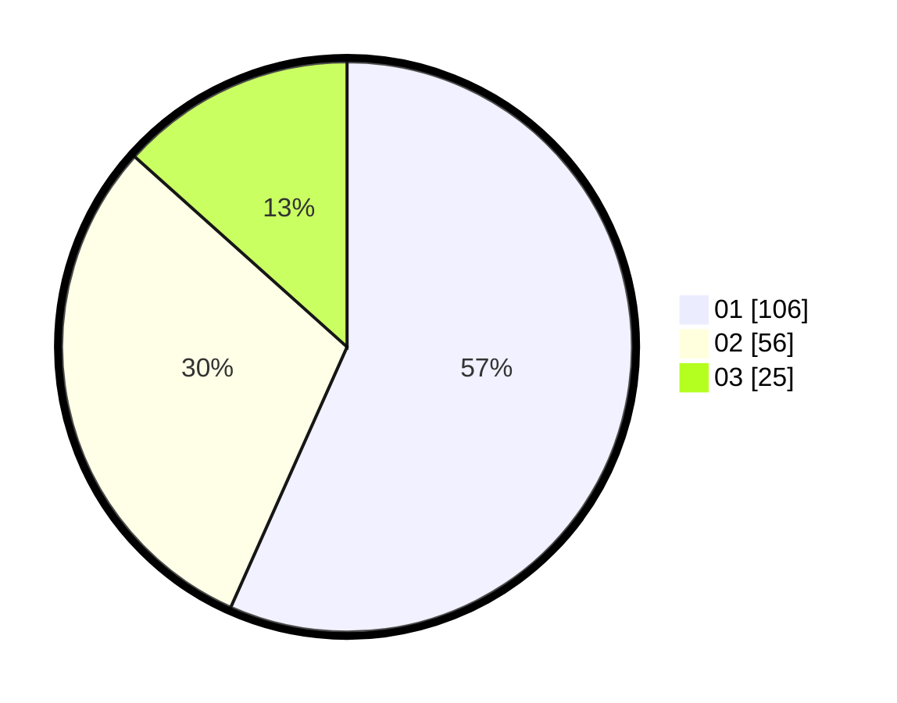

# Hasil

Hasil perolehan suara paslon dapat dilihat pada file paslon-01.txt, paslon-02.txt, dan paslon-03.txt.

Jika tidak ada, artinya data tersebut belum ada pada SIREKAP.

## Perolehan Suara

 * Paslon 01: **106**.
 * Paslon 02: **56**.
 * Paslon 03: **25**.

## Foto C Plano

https://sirekap-obj-formc.kpu.go.id/8ac3/pemilu/ppwp/31/74/01/10/05/3174011005081-20240214-192438--ccc11fe5-8c81-467f-b30f-c313c6285c7b.jpg

https://sirekap-obj-formc.kpu.go.id/8ac3/pemilu/ppwp/31/74/01/10/05/3174011005081-20240214-160139--bf4e31fb-d5c0-4366-bdf1-b458091270fd.jpg

https://sirekap-obj-formc.kpu.go.id/8ac3/pemilu/ppwp/31/74/01/10/05/3174011005081-20240214-155621--d211522f-16e3-450c-989a-98587e6a7311.jpg
