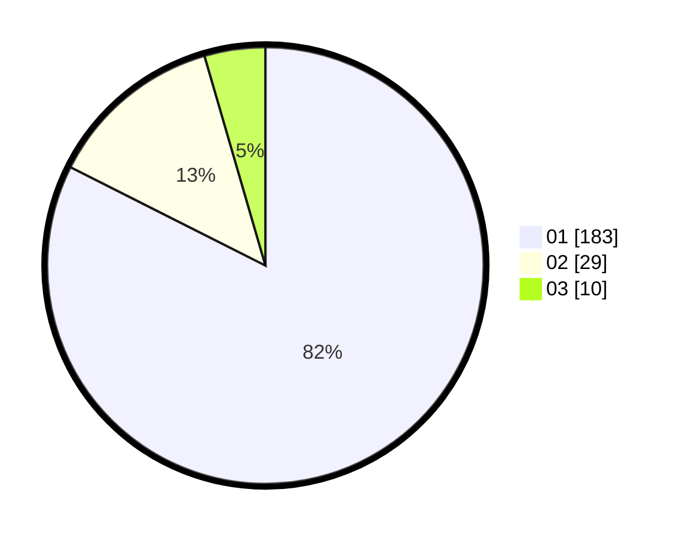

# Hasil

Hasil perolehan suara paslon dapat dilihat pada file paslon-01.txt, paslon-02.txt, dan paslon-03.txt.

Jika tidak ada, artinya data tersebut belum ada pada SIREKAP.

## Perolehan Suara

 * Paslon 01: **183**.
 * Paslon 02: **29**.
 * Paslon 03: **10**.

## Foto C Plano

https://sirekap-obj-formc.kpu.go.id/5a6f/pemilu/ppwp/31/74/01/10/05/3174011005084-20240214-193725--9dca3326-ab48-4c36-af37-2a9ece80df8e.jpg

https://sirekap-obj-formc.kpu.go.id/5a6f/pemilu/ppwp/31/74/01/10/05/3174011005084-20240214-184911--5186b512-d573-4a54-8c86-92c8beb49359.jpg
