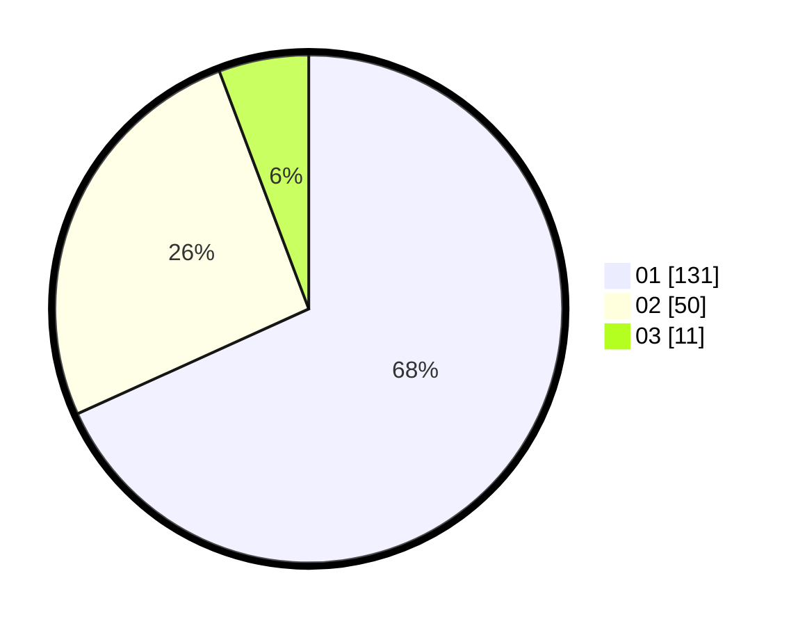

# Hasil

Hasil perolehan suara paslon dapat dilihat pada file paslon-01.txt, paslon-02.txt, dan paslon-03.txt.

Jika tidak ada, artinya data tersebut belum ada pada SIREKAP.

## Perolehan Suara

 * Paslon 01: **131**.
 * Paslon 02: **50**.
 * Paslon 03: **11**.

## Foto C Plano

https://sirekap-obj-formc.kpu.go.id/42ee/pemilu/ppwp/31/74/01/10/05/3174011005085-20240214-211031--f9a1a27a-09ea-48cf-8cb2-886bf0166ce7.jpg

https://sirekap-obj-formc.kpu.go.id/42ee/pemilu/ppwp/31/74/01/10/05/3174011005085-20240214-201220--d60f603f-5127-4817-a039-18d9a34e828e.jpg

https://sirekap-obj-formc.kpu.go.id/42ee/pemilu/ppwp/31/74/01/10/05/3174011005085-20240214-201309--8653676e-dfa1-4000-9bd7-e272ecaa9aa8.jpg

## DATA PEMILIH TETAP

Jumlah pemilih dalam DPT: **203**.
 * L: **111**.
 * P: **92**.

## DATA PENGGUNA HAK PILIH

Jumlah pengguna hak pilih dalam DPT: **194**.
 * L: **104**.
 * P: **90**.

Jumlah pengguna hak pilih dalam DPTb: **0**.
 * L: **0**.
 * P: **0**.

Jumlah pengguna hak pilih dalam DPK: **2**.
 * L: **1**.
 * P: **1**.

Jumlah pengguna hak pilih: **196**.
 * L: **105**.
 * P: **91**.

## JUMLAH SUARA SAH DAN TIDAK SAH

JUMLAH SELURUH SUARA SAH: **192**.

JUMLAH SUARA TIDAK SAH: **4**.

JUMLAH SELURUH SUARA SAH DAN SUARA TIDAK SAH: **196**.
