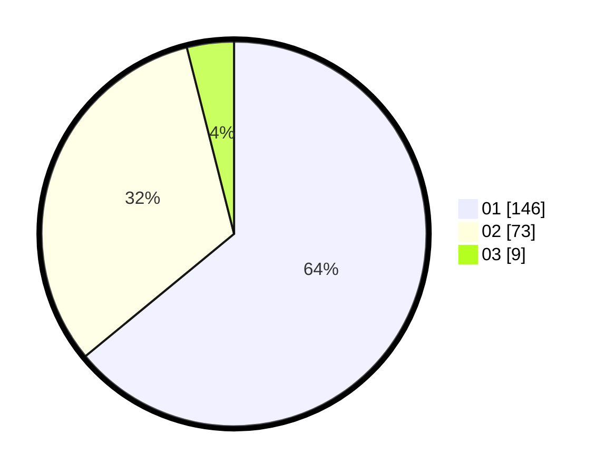

# Hasil

Hasil perolehan suara paslon dapat dilihat pada file paslon-01.txt, paslon-02.txt, dan paslon-03.txt.

Jika tidak ada, artinya data tersebut belum ada pada SIREKAP.

## Perolehan Suara

 * Paslon 01: **146**.
 * Paslon 02: **73**.
 * Paslon 03: **9**.

## Foto C Plano

https://sirekap-obj-formc.kpu.go.id/25ae/pemilu/ppwp/31/74/01/10/05/3174011005089-20240214-212314--ebdd9873-1750-4c21-a402-cfce119eae24.jpg

https://sirekap-obj-formc.kpu.go.id/25ae/pemilu/ppwp/31/74/01/10/05/3174011005089-20240214-211027--540113c6-e3d1-4e61-97ab-c4274f5400e2.jpg

https://sirekap-obj-formc.kpu.go.id/25ae/pemilu/ppwp/31/74/01/10/05/3174011005089-20240214-211046--21dbb2a8-ca61-4f06-a668-a1855038daa6.jpg
