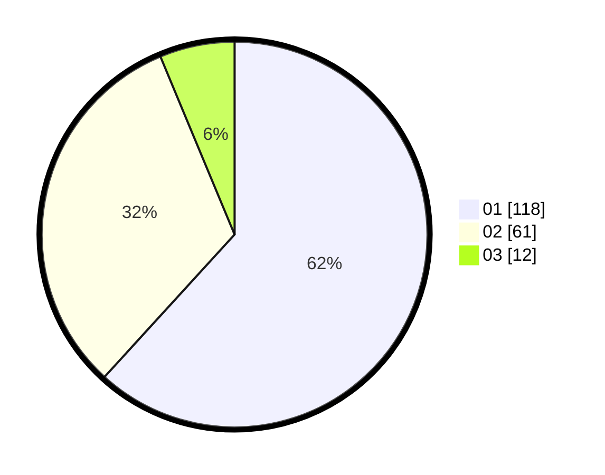

# Hasil

Hasil perolehan suara paslon dapat dilihat pada file paslon-01.txt, paslon-02.txt, dan paslon-03.txt.

Jika tidak ada, artinya data tersebut belum ada pada SIREKAP.

## Perolehan Suara

 * Paslon 01: **118**.
 * Paslon 02: **61**.
 * Paslon 03: **12**.

## Foto C Plano

https://sirekap-obj-formc.kpu.go.id/8f43/pemilu/ppwp/31/74/01/10/05/3174011005098-20240214-235108--cea236dd-3044-418f-822e-71db1f9649e6.jpg

https://sirekap-obj-formc.kpu.go.id/8f43/pemilu/ppwp/31/74/01/10/05/3174011005098-20240214-195814--d8f07c21-6305-41c0-8a49-f9b5c971fbd4.jpg

https://sirekap-obj-formc.kpu.go.id/8f43/pemilu/ppwp/31/74/01/10/05/3174011005098-20240214-234946--88877bda-4367-4d0f-bad3-3e561c4a34fa.jpg
